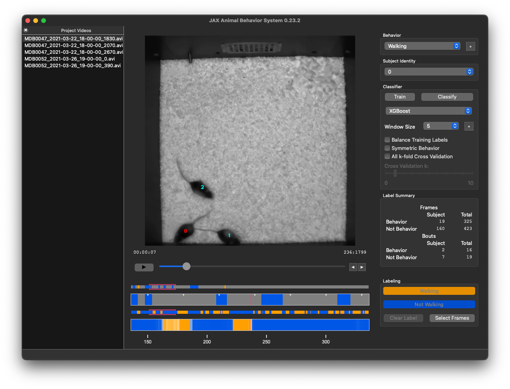

# JAX Animal Behavior System (JABS)



## ReadTheDocs Tutorial and User Guide

https://jabs-tutorial.readthedocs.io/en/latest/index.html

[User Guide (Markdown)](https://github.com/KumarLabJax/JABS-behavior-classifier/blob/main/src/jabs/resources/docs/user_guide/user_guide.md)

## Copyright

Copyright 2023 The Jackson Laboratory -- All rights reserved.

## Contact

email us at jabs@jax.org

## License

JABS is licensed under a non-commercial use license, see LICENSE for more information. Contact us for information about
licensing for commercial use.

## Pose Files

JABS requires pose files generated from the Kumar Lab's mouse pose estimation neural networks. Single mouse pose files 
are generated from [this repository](https://github.com/KumarLabJax/deep-hrnet-mouse). Multi-mouse is still under development. Contact us for more information.

## Requirements

JABS was initially developed and tested on Python 3.10. See the `pyproject.toml` for a list of required Python 
packages. These packages are available from the Python Package Index (PyPI).

Currently, JABS supports Python 3.10 through 3.13.

## Installation

We recommend installing JABS in a dedicated Python virtual environment.

### Create a Virtual Environment

```bash
python -m venv jabs.venv

# Linux and macOS
source jabs.venv/bin/activate

# Windows (cmd)
jabs.venv\Scripts\activate.bat
```

> Developers may prefer using [uv](https://docs.astral.sh/uv/getting-started/installation/) for environment and dependency management (see the JABS Developer Setup section below).

### Install from PyPI (Recommended)

JABS can be installed directly from the Python Package Index:

```bash
pip install jabs-behavior-classifier
```

This will install JABS and all required dependencies automatically.

### Install from Source

If you want the latest development version or need to install a specific branch/commit:

#### From GitHub

```bash
pip install git+https://github.com/KumarLabJax/JABS-behavior-classifier.git
```

Specify a branch or commit if needed:

```bash
pip install git+https://github.com/KumarLabJax/JABS-behavior-classifier.git@branch-name
pip install git+https://github.com/KumarLabJax/JABS-behavior-classifier.git@commit-hash
```

#### From Local Clone

If you’ve cloned the JABS repository:

```bash
pip install .
```

#### Windows Setup Helpers

Two batch scripts are included for Windows users working with a local clone:

- **`setup_windows.bat`** — Creates a `jabs.venv` virtual environment and installs JABS.  
- **`launch_jabs.bat`** — Activates the environment and launches the JABS GUI.

Double-click these scripts in Windows Explorer to run them.

### Enabling XGBoost Classifier

The XGBoost Classifier has a dependency on the OpenMP library. This does not ship with macOS. XGBoost should work "out 
of the box" on other platforms. On macOS, you can install libomp with Homebrew (preferred) with the following 
command `brew install libomp`. You can also install libomp from source if you can't use Homebrew, but this is beyond 
the scope of this Readme.

---

## Running JABS

After installation, the following commands are available in your environment:

- `jabs` — launch the JABS GUI  
- `jabs-init` — initialize a new JABS project directory or recompute features in an existing project 
- `jabs-classify` — run a trained classifier  
- `jabs-stats` — print accuracy statistics for a classifier  
- `jabs-export-training` — export training data from an existing JABS project
- `jabs-cli` - collection of smaller command line utilities

You can view usage information for any command with:

```bash
<jabs-command> --help
```

## Sample Data

We provide sample data for testing and demonstration purposes. You can download the sample data from
https://doi.org/10.5281/zenodo.16697331

---

## Singularity/Linux

We supply a tested pair of singularity definition files. The [first vm](vm/headless.def) is intended for command-line use on 
compute clusters when scaling inferences. The [second vm](vm/gui.def) is designed for interacting with the GUI in a portable 
environment. Please inspect the definition files for related linux packages to run the software.

## JABS Project Portability

We have 4 version numbers in our software:

* JABS Python package version. This gets bumped every release.
* Feature version. This gets bumped every time we change feature values or the format used to store 
calculated features.
* Classifier version. This gets bumped every time we change characteristics of classifiers.
* Prediction version. This gets bumped every time we change how predictions are stored.

### Long Term Support of JABS-based Classifiers

There are multiple JABS Classifier artifacts that have different compatibility and portability characteristics.

* Project folders. These are the most compatible for upgrades. The vast majority of our upgrades to JABS will allow
transparent upgrades (e.g. re-generation of features) within the project folder without user interaction. We will
provide instructions for changes that are not.
* Exported training data. These are compatible across computers, but should generally not be considered compatible
across JABS package versions. Once we add the appropriate version checks, the error message should be a bit more
clear when and why these aren't compatible across versions.
* Classifier pickle files. These are only compatible within a specific install of the package (e.g. mac will not
be compatible with windows). These are the serialized trained classifiers, so load really fast, but should not be 
considered portable beyond the computer and specific JABS install that created them.

Project folders are big, but are almost always compatible across JABS versions.

Exported classifiers are smaller and easier to move around, but might require the same JABS package version to run. These 
are good for sharing or archiving specific versions (e.g. a version we use in a paper). A comon use case is to export
training data from a project folder, transfer it to our HPC cluster, and then train a and run classifier using the 
`jabs-classify` command from same version of JABS that was used to export the training file.

Pickle files are tiny and efficient, but are not transferable across computers. We use these for large-scale 
predictions in pipelines (for example, using exported training data to train a classifier saved as a .pickle file, 
which can then be used to classify many videos as part of a pipeline).


## JABS Developer Setup

The following instructions are for Linux or macOS Developers. Commands for JABS developers using Windows might be 
slightly different.

This project now uses **uv** for dependency management and building. Poetry is no longer required.

JABS developers will need to install uv by following the instructions on 
[uv's official website](https://docs.astral.sh/uv/getting-started/installation/).

1) **Clone** the repository and enter the project directory.

2) **Create/activate** a virtual environment (uv recommended):

Note, if you don't want to activate the virtualenv, you can use `uv run <command>` to run commands in the virtualenv.
If you don't want to activate the virtualenv, you can skip this step.

```bash
uv venv
source .venv/bin/activate   # Linux/macOS
# .venv\Scripts\Activate.ps1 # Windows PowerShell
```

3) **Install dependencies** in editable mode:

```bash
uv sync
```

This will install all dependencies and JABS will be installed in "editable" mode, meaning that the JABS Python modules 
installed in the virtualenv will be links to the files in the cloned git repository. JABS code changes will be 
reflected immediately in the Python environment.

Note to Developers: JABS uses package metadata to determine the version number. If you change the version number in the 
pyproject.toml file, you will need to run `uv sync` to update the version number in the installed package so 
that the GUI will display the correct version.


### Adding Dependencies
```
uv add <package>            # runtime dependency
uv add --dev <package>      # dev-only dependency
```


### Code Style

JABS uses [ruff](https://docs.astral.sh/ruff/) for linting and formatting. Developers should run `ruff check` and `ruff format` before 
committing code. A pre-commit hook is provided to run these commands automatically.

To install pre-commit hooks for linting and formatting run:

```commandline
pre-commit install
```

You can also run [ruff](https://docs.astral.sh/ruff/) directly from command line:

```commandline
ruff check src/packagepath/modulename.py
ruff format src/packagepath/modulename.py
```

### Building Python Packages

Build wheels and source distributions with uv:

```bash
uv build
```

This will produce both a .tar.gz and a Python Wheel file (.whl) in the dist directory. 

The wheel file can be installed with pip:
```
pip install jabs_behavior_classifier-<version>-py3-none-any.whl
```

Since the Wheel does not contain any compiled code it is platform independent.

### CI/CD and Release Management

JABS uses GitHub Actions for continuous integration and automated releases to PyPI. 
The CI/CD pipeline is defined in `.github/workflows/` and automatically manages package building, testing, and publishing.

#### Pull Request Checks

Pull requests to the `main` branch trigger automated checks to ensure code quality and functionality:

1. **Code Formatting and Linting**: Ensures code adheres to style guidelines
2. **Test Execution**: Runs the full test suite to verify functionality

#### Automated Release Process

The release process is triggered automatically when the version number in `pyproject.toml` is changed on the `main` branch:

1. **Version Detection**: The workflow monitors changes to `pyproject.toml` and extracts the version number
2. **Pre-release Detection**: Versions containing letters (e.g., `1.0.0a1`, `2.1.0rc1`) are automatically marked as pre-releases
3. **Build Pipeline**: If version changed, the system runs:
   - Code formatting and linting checks
   - Test execution
   - Package building with `uv build`
4. **PyPI Publishing**: Successfully built packages are automatically published to PyPI
5. **GitHub Release**: A corresponding GitHub release is created with build artifacts

#### Release Workflow Files

- **`.github/workflows/release.yml`**: Main release workflow that orchestrates the entire process
- **`.github/workflows/_format-lint-action.yml`**: Reusable workflow for code quality checks
- **`.github/workflows/_run-tests-action.yml`**: Reusable workflow for test execution
- **`.github/workflows/pull-request.yml`**: CI checks for pull requests

#### Creating a New Release

To create a new release:

1. Update the version number in `pyproject.toml`:
   ```toml
   version = "X.Y.Z"  # for stable releases
   version = "X.Y.Za1" # for alpha pre-releases
   version = "X.Y.Zrc1" # for release candidates
   ```

2. Re-lock the uv lock file:
   ```bash
   uv lock
   ```

3. Commit and push the change:
   ```bash
   git add pyproject.toml uv.lock
   git commit -m "Bump version to X.Y.Z"
   ```
   
4. Merge your changes into the `main` branch via a pull request.

3. The CI/CD pipeline will automatically:
   - Detect the version change
   - Run all quality checks and tests
   - Build and publish the package to PyPI
   - Create a GitHub release with generated release notes

#### Environment Requirements

The release workflow requires:
- **PyPI API Token**: Stored as `PYPI_API_TOKEN` in GitHub repository secrets
