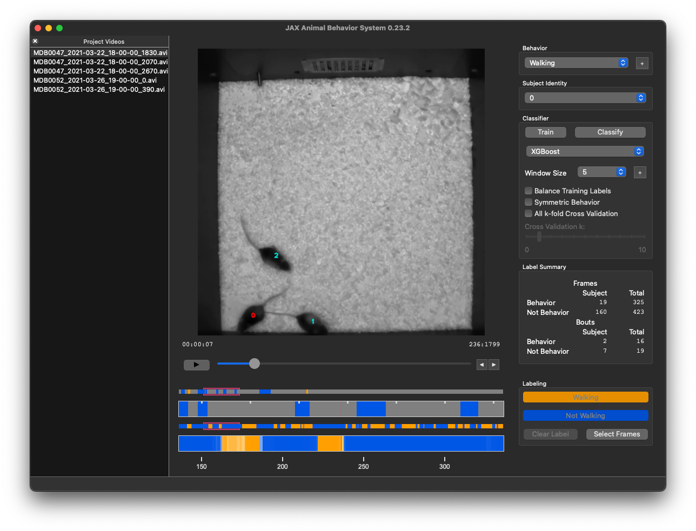

<div align="center">

# JAX Animal Behavior System (JABS)

**An open-source platform for standardized mouse behavioral phenotyping.**

[](https://www.python.org/downloads/)
[](https://pypi.org/project/jabs-behavior-classifier/)
[](LICENSE)
[](https://doi.org/10.7554/eLife.107259.2)

[Documentation](https://jabs-tutorial.readthedocs.io/) · [User Guide](docs/user-guide/overview.md) · [Sample Data](https://doi.org/10.5281/zenodo.16697331) · [Contact Us](mailto:jabs@jax.org)

---



</div>

## Features

- **Interactive GUI** for behavior annotation and classifier training
- **Machine learning-powered** automatic behavior classification
- **XGBoost support** for high-performance classification
- **Command-line tools** for batch processing and HPC integration
- **Singularity containers** for reproducible deployments

## Quick Start

### Installation (Recommended)

```bash
# Using pipx (recommended)
pipx install jabs-behavior-classifier

# OR using uv
uv tool install jabs-behavior-classifier
```

### Run Without Installing

```bash
uvx --from jabs-behavior-classifier jabs
```

### Launch JABS

```bash
jabs              # Launch the GUI
jabs-init --help  # View project initialization options
```

> **Note:** The first launch may take a few minutes to initialize. Subsequent launches will be much faster.

## Installation Options

<details>
<summary><strong>Install from PyPI</strong></summary>

```bash
pip install jabs-behavior-classifier
```

</details>

<details>
<summary><strong>Install from Source</strong></summary>

```bash
# From GitHub
pip install git+https://github.com/KumarLabJax/JABS-behavior-classifier.git

# Specific branch or commit
pip install git+https://github.com/KumarLabJax/JABS-behavior-classifier.git@branch-name

# From local clone
git clone https://github.com/KumarLabJax/JABS-behavior-classifier.git
cd JABS-behavior-classifier
pip install .
```

</details>

<details>
<summary><strong>Virtual Environment Setup</strong></summary>

```bash
python -m venv jabs.venv

# Linux/macOS
source jabs.venv/bin/activate

# Windows
jabs.venv\Scripts\activate.bat

pip install jabs-behavior-classifier
```

</details>

<details>
<summary><strong>macOS: Enable XGBoost</strong></summary>

XGBoost requires the OpenMP library, which doesn't ship with macOS:

```bash
brew install libomp
```

</details>

## Command Line Tools

| Command                | Description                                    |
|------------------------|------------------------------------------------|
| `jabs`                 | Launch the JABS GUI                            |
| `jabs-init`            | Initialize a new project or recompute features |
| `jabs-classify`        | Run a trained classifier                       |
| `jabs-export-training` | Export training data from a project            |
| `jabs-cli`             | Collection of utility commands                 |

Run `<command> --help` for detailed usage information.

## Prerequisites

JABS requires pose files generated from the Kumar Lab's mouse pose estimation neural networks:
- **Single mouse:** [deep-hrnet-mouse](https://github.com/KumarLabJax/deep-hrnet-mouse)
- **Multi-mouse:** Under development — [contact us](mailto:jabs@jax.org) for more information

## Singularity/Linux

We provide tested Singularity definition files for Linux environments:

| Container                       | Use Case                                  |
|---------------------------------|-------------------------------------------|
| [headless.def](vm/headless.def) | Command-line use on compute clusters      |
| [gui.def](vm/gui.def)           | Interactive GUI in a portable environment |

Please inspect the definition files for related Linux packages required to run the software.

## Project Portability

JABS uses four version numbers to track compatibility:

| Version                | Description                                          |
|------------------------|------------------------------------------------------|
| **Package version**    | Bumped every release                                 |
| **Feature version**    | Bumped when feature values or storage format changes |
| **Classifier version** | Bumped when classifier characteristics change        |
| **Prediction version** | Bumped when prediction storage format changes        |

### Artifact Compatibility

| Artifact                    | Portability              | Best For                          |
|-----------------------------|--------------------------|-----------------------------------|
| **Project folders**         | Cross-version compatible | Long-term storage, upgrades       |
| **Exported training data**  | Same JABS version        | Sharing, archiving, HPC workflows |
| **Classifier pickle files** | Same machine only        | Large-scale pipeline predictions  |

<details>
<summary><strong>Detailed Portability Information</strong></summary>

**Project folders** are the most compatible for upgrades. The vast majority of JABS upgrades allow transparent upgrades (e.g., re-generation of features) within the project folder without user interaction. We will provide instructions for changes that are not automatically compatible. Project folders are large but are almost always compatible across JABS versions.

**Exported training data** is compatible across computers but should generally not be considered compatible across JABS package versions. Once we add the appropriate version checks, error messages should be clearer about when and why these aren't compatible across versions. A common use case is to export training data from a project folder, transfer it to an HPC cluster, and then train and run a classifier using the `jabs-classify` command from the same version of JABS that was used to export the training file.

**Classifier pickle files** are the serialized trained classifiers. They load very fast and are tiny and efficient, but are only compatible within a specific install of the package (e.g., macOS will not be compatible with Windows). These should not be considered portable beyond the computer and specific JABS install that created them. We use these for large-scale predictions in pipelines—for example, using exported training data to train a classifier saved as a `.pickle` file, which can then be used to classify many videos as part of a pipeline.

</details>

## Documentation

- **[ReadTheDocs Tutorial](https://jabs-tutorial.readthedocs.io/)** — Complete user guide and tutorials
- **[User Guide](docs/user-guide/overview.md)** — Markdown documentation
- **[Sample Data](https://doi.org/10.5281/zenodo.16697331)** — Test datasets for demonstration

## Contributing

Interested in contributing? Check out our:
- [Contributing Guide](CONTRIBUTING.md)
- [Development Guide](docs/DEVELOPMENT.md)

## Citation

If you use JABS in your research, please cite:

> Choudhary, A., Geuther, B. Q., Sproule, T. J., Beane, G., Kohar, V., Trapszo, J., & Kumar, V. (2025). JAX Animal Behavior System (JABS): A genetics informed, end-to-end advanced behavioral phenotyping platform for the laboratory mouse. *eLife*, 14:RP107259. https://doi.org/10.7554/eLife.107259.2

## License

Copyright 2023 The Jackson Laboratory — All rights reserved.

JABS is licensed under a **non-commercial use license**. See [LICENSE](LICENSE) for details.

For commercial licensing inquiries, [contact us](mailto:jabs@jax.org).

## Acknowledgements

JABS was influenced by JAABA (Janelia Automatic Animal Behavior Annotator) developed by the Branson lab at Janelia Research Campus of the Howard Hughes Medical Institute. We are grateful for their pioneering work in automated behavior classification.

> Kabra, M., Robie, A., Rivera-Alba, M. et al. JAABA: interactive machine learning for automatic annotation of animal behavior. *Nature Methods* 10, 64–67 (2013). https://doi.org/10.1038/nmeth.2281

---

<div align="center">

**[The Jackson Laboratory](https://www.jax.org/)** · [Kumar Lab](https://www.kumarlab.org/)

[jabs@jax.org](mailto:jabs@jax.org)

</div>