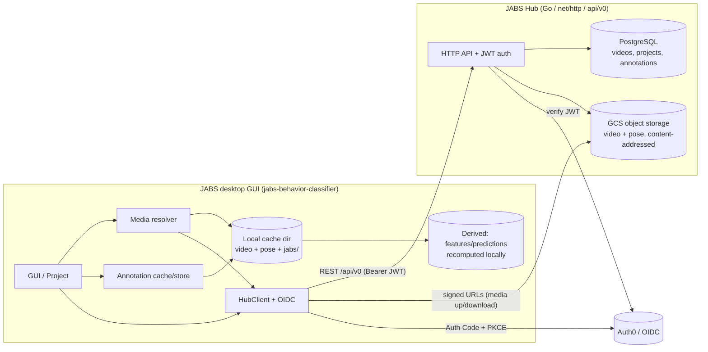
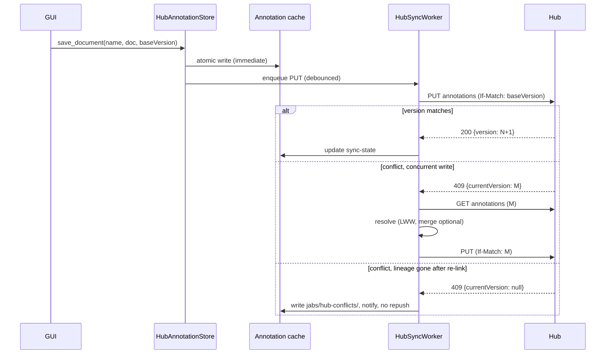

# Plan: Hub-Backed JABS Projects — Client Integration (jabs-behavior-classifier)

- **Status:** Draft / planning
- **Author:** Glen Beane (with Claude Code)
- **Repository:** `jabs-behavior-classifier` (this repo — the PySide6 desktop GUI / Python client).
- **Companion doc:** the Hub-side (Go) design lives in the `jabs-hub` repo at
  `docs/specs/0006-jabs-project-backend-design.md`. The REST API, the PostgreSQL data model, and the
  annotation-document schema (Appendix A.1) are the **shared contract** — keep them in sync.
- **Scope:** the client half of Hub-backed JABS projects under a **cloud-native** model: the desktop
  GUI becomes a caching client that pulls videos, pose files, annotations, and project metadata from
  JABS Hub / Google Cloud Storage into a local cache, works against the cache (frame-accurate
  labeling, feature extraction, training, offline), and pushes changes back.

---

## 1. Overview — JABS Hub-backed projects

A **Hub-backed JABS project is a cloud project**: its videos, pose files, behavior annotations,
and project metadata all live in **JABS Hub** (PostgreSQL + Google Cloud Storage, at
`github.com/TheJacksonLaboratory/jabs-hub`). The desktop GUI is a **caching client** — it pulls
what it needs from Hub / GCS into a local **cache directory**, works against the cache, and pushes
changes back. There is **no hybrid**: a Hub-backed project never has authoritative local-only
media. Local-only (non-Hub) projects are unchanged.

- **Videos live in a shared library.** Videos — external/uploaded files *or* JABS-2.0 device
  recordings — are uploaded into a Hub **video library**, decoupled from any recording session. A
  project references library videos **many-to-many**: one stored copy can back multiple projects.
- **Source of truth = cloud; local = cache.** One uniform pull → cache → push model for every
  *source* artifact (video, pose, annotations, metadata). **Derived** artifacts (features,
  predictions, classifiers) are recomputed locally from the cached pose and stay local (§4.9).
- **Offline-first.** The cache makes a project fully usable offline; edits queue and sync on
  reconnect.
- **Primary driver.** Replace the "zip up `jabs/annotations/` and email it" label-sharing workflow
  with automatic, versioned sync (§2.3). Because the exact pose file also comes from Hub, the
  identity-alignment footgun (labels are keyed by identity, which the pose file defines) is
  **eliminated**, not merely flagged.

**This is a two-part plan**, split across the two repositories it touches:

- **Client integration** — *this document* (`jabs-behavior-classifier`): OIDC auth, the Hub
  client, the caching layer (media resolver + annotation cache), sync engine, opt-in/open flows,
  and playback of Hub-hosted media.
- **Hub backend** — `jabs-hub` repo, `docs/specs/0006-jabs-project-backend-design.md`: the video
  library + decoupled upload, the `projects` / `project_videos` (many-to-many) / `annotations`
  data model, the REST API, membership/authorization, and media object storage.

### Phasing (cloud-native, library-first build order)

| Phase | Title | Delivers |
|------|-------|----------|
| **0** | Foundations | OIDC auth in the client + `HubClient`; the client cache/abstraction seams (annotation store + media resolver) landed as a pure refactor with local-only behavior unchanged. (Hub: auth on new routes, base scaffolding.) |
| **1** | Video library + media | Client: a Hub-aware media resolver + local media cache + lazy hydration + playback prefetch — download/cache to **open and play** a Hub project's videos. (Uploading into the library is a web-UI / `jabs-cli` concern.) (Hub: `videos` table, decoupled upload, list/search, content-addressed storage, signed download.) Deliverable: the GUI opens a Hub project and plays its videos. **Hub prerequisite: a signed download URL for a library video's *video* bytes — only `pose-url` exists today (§5.1).** |
| **2** | Hub-backed projects | Client: **open** a cloud project (created in the web UI) referencing library videos; the local project dir is a cache; project-settings sync. (Hub: `projects` + `project_members` + `project_videos` join + metadata.) |
| **3** | Annotations (label sharing) | Client: annotation cache + sync engine + offline outbox + conflict handling; pose consistency guaranteed. (Hub: `annotations` + history + optimistic-concurrency contract + behavior index.) Delivers the label-sharing payoff. |
| **Post-MVP** | Collaboration + ML | Web preview playback + prediction-track overlay (library browse itself is part of the initial web UI), classifier registry/model cards, real-time collaboration, normalized fine-grained labels. |

Phase 0 lands the seams first so they are independently reviewable and de-risk the rest (mirrors
the 0001 Parquet feature-cache implementation plan, which extracted the I/O boundary
before changing behavior).

**Relationship to prior work:** this supersedes the older *"JABS Hub"* Word design doc (the
device/recording/processing platform already exists) **and** an earlier iteration of this plan that
migrated annotations first and left media local. The cloud-native model was chosen deliberately
over that piecemeal approach: the video library needs cloud media anyway, and full cloud storage
makes the label-sharing use case correct (shared pose ⇒ aligned identities) rather than merely
warned.

---

## 2. Goals, Non-Goals, and Motivating Use Cases

### 2.1 Goals

1. **Cloud-native Hub-backed projects.** A Hub-backed project stores its video, pose, annotations,
   and metadata in Hub; the GUI caches locally and stays fully usable offline. Local-only projects
   are unaffected.
2. **Video library as the media home.** The GUI pulls library videos (and pose) down for
   playback/labeling/training. Uploading into the library is a web-UI / `jabs-cli` task, not a
   desktop-GUI flow.
3. **Automatic annotation sync** with version history, attribution, and conflict handling —
   replacing the manual zip hand-off.
4. **Uniform caching model.** One pull/cache/push mechanism for every source artifact; derived
   artifacts recomputed locally from the cached pose.
5. **Single source of authority.** Hub is authoritative online; the client reconciles the cache
   against it, resolving the "which copy is current" ambiguity.

### 2.2 Non-Goals

- Replacing the desktop GUI with a web labeling client. The GUI stays the frame-accurate labeling
  surface; the JABS Hub web UI (to be developed) creates/manages projects and the video library but
  does not do frame-accurate labeling.
- **Creating or managing Hub projects in the desktop GUI** (create a project, add library videos,
  share) — that happens in the JABS Hub web UI. The desktop GUI **opens** an existing Hub project by
  its identifier (§4.7).
- Storing **derived** artifacts (features/predictions/classifiers) in Hub for the MVP — they are
  recomputed locally from the cached pose (§4.9). An **optional cloud cache for features** (the
  expensive one) and a classifier registry for predictions/classifiers are post-MVP (§10).
- Real-time collaborative cursors / live presence (post-MVP).
- True frame streaming of remote video (playback is download-to-cache + prefetch; §4.6).
- **Fine-grained permissions** — client-side handling of Hub's `VIEWER`/`EDITOR`/`ADMIN` roles,
  per-video/per-behavior rights, group- or lab-level access. The MVP is authenticated access +
  per-project membership, enforced by Hub — see §2.5 for the full in-scope / out-of-scope breakdown,
  and D24.

### 2.3 Motivating use cases

1. **Asymmetric label sharing (primary driver; needs Phase 3 annotation sync *and* project sharing, D19).** A behavior expert labels
   videos; a colleague trains/evaluates classifiers from those labels. Today the expert zips
   `<project>/jabs/annotations/` and sends it — manual, overwrites local work, no history, and no
   guarantee both sides use the *same* pose file. In a cloud project both users open the same Hub
   project; labels sync automatically with history and attribution, and because the **pose file is
   pulled from Hub too**, the collaborator's labels always align to the correct identities. No zip,
   no overwrite, no pose-mismatch footgun.
2. **Create a project in the web UI, open it in the GUI.** In the JABS Hub web UI a user creates a
   project and adds videos to it from the library (JABS recordings or uploaded external files), then
   opens it in the desktop GUI (§4.7) — the media hydrates on demand.
3. **Work from any machine / HPC** with no manual file copying — the cache hydrates from Hub.
4. **Going offline, or onto low bandwidth.** Before a flight, a field trip, or a move to a slow or
   metered link, a user hydrates the **whole** project in one deliberate action — every video, pinned
   pose file, and annotation document — instead of relying on lazy per-video downloads that would
   fail once the connection is gone, and pins it so cache eviction leaves it alone (§4.6, D22).

### 2.4 Unobtrusiveness for non-Hub users (hard requirement)

Many JABS users do not have access to (or do not use) JABS Hub. Hub integration MUST be invisible
to them:

- **No startup cost.** The app launches and every local-project workflow behaves exactly as today —
  no network calls, no auth prompts, no "sign in to Hub" nags, no added latency. Hub code paths are
  **lazy-imported** and never execute until the user invokes a Hub action.
- **One unobtrusive entry point.** A single **File → "Open Project from JABS Hub"** menu item
  (§4.7); no toolbars, banners, or modal prompts intrude on local use. Local project open/create
  never touches Hub.
- **Opt-in auth.** OIDC login is triggered only by a Hub action, never at startup; credentials live
  in the OS keyring, never in project files.
- **Graceful absence.** If the Hub client dependency or connectivity is unavailable, only Hub
  actions are affected — local projects are untouched, with a clear message rather than a crash.

A regression test asserts that launching the app and opening a local project make **zero** Hub
imports or network calls (§7).

### 2.5 Permissions and authorization — what is in and out of scope

Authorization is **enforced by Hub**, not by the client (Hub doc D5, recorded in the `jabs-hub`
repo as **ADR-0014 — *Identity, Access, and Attribution***, amended 2026-08-09; its filename still
reads `0014-project-membership-authorization.md`, which predates that widened scope), but the *goals*
it has to meet belong in scope here so they are not left implicit. Users are **not** assumed to be
uniformly trustworthy with write access to everything.

> **Status: this section describes ADR-0014's design, which is not built yet.** The ADR is
> **Proposed**, and none of its mechanisms exist in Hub today — no `users`, no `visibility` /
> `owner_subject`, no `project_members`, no role enforcement (§5.1). What ships now is
> authenticated-only access to a library with no visibility predicate. Everything below is therefore
> the target the client is built *against*, not behavior the client may rely on during Phases 1-2;
> the client-side rules it implies (do not present library media as project-private, do not build
> open-catalogue UI) hold regardless and are the reason to record it here.

**In scope (MVP)**

- **Authenticated access only.** Every Hub request carries an OIDC access token (§4.5); there is no
  anonymous, shared-secret, or unauthenticated read path. Without a token the client sees no projects.
- **Per-project membership, enforced server-side on every request.** A project is to have a membership
  set (`project_members`) that Hub authorizes each call against. Per D19 projects are **personal** in
  the first cut, so the MVP membership set is normally one user — but the check is a membership check
  from day one, so sharing is an added row, not a redesign. Each row is specified to carry a **role**
  (`VIEWER` / `EDITOR` / `ADMIN`, ADR-0014 Decision 2) and to FK a `users` registry, so a member Hub
  has never seen becomes *unrepresentable* rather than rejected by a handler. The client does not vary
  its behavior by role (below).
- **Membership gates projects; the library has its own visibility predicate.** A library video exists
  before and independently of any project (ADR-0012), so "who is a member" is not by itself a
  well-defined question for library media. **ADR-0014 Decision 6** answers it with a real predicate,
  evaluated on every library read *and* every signed-URL mint: access is the **union** of the video's
  own `visibility` and membership in any containing **study or project**. Three consequences the client
  has to hold at once:
  - **Project membership *does* grant read access to that project's videos**, through the union's
    `project_videos ⋈ project_members` clause — not as a side effect of an open catalogue.
  - **Reads will nonetheless be effectively lab-wide**, because `videos.visibility` is specified to
    default to `'LAB'` (the only other value is `'PRIVATE'`). The *data* is permissive by design, with
    the *policy* live on every request. Any colleague with Hub access can list and download library
    media, including the videos a project pins. **Today this is true for a stronger reason** — the
    predicate is not built at all, so the library is readable by any authenticated caller (§5.1).
  - **Writes to an existing library video are narrower:** its `owner_subject`, or a study/project
    member with write access. **Creating** a video is unaffected, and `POST /videos/{id}/pose-runs` —
    which spends GPU — is gated at write level (ADR-0014 Decision 7). None of this constrains the
    desktop client, which neither creates library videos nor starts pose runs (§5).

  This **narrows** ADR-0001 §4 ("the API checks project membership before generating any URL") rather
  than abandoning it: Hub is to check before minting, with the check defaulting to lab-wide. Client
  guidance, and the reason this matters before the predicate exists: do not present library media as
  though it were private to the project that references it, and equally do not build UI that assumes an
  open catalogue — keep every browse path behind a filtered query so that narrowing what Hub returns
  changes a query parameter rather than a screen. **Projects and annotations**, the scientific work
  product, remain what project membership most directly protects; the lab-wide library *default* is the
  MVP posture, **not the end state** (below).
- **The client is not a trust boundary.** The GUI only *reflects* permissions (e.g. greying out
  labeling for a project it may not write); it never grants them. A patched client, a hand-edited
  `hub.json`, or a guessed project ID gains nothing — every read and write is re-authorized by Hub.
- **Possessing a project identifier is not access.** Pasting a project link (§4.7) only names the
  project; the caller must still be a member. Links are shareable *because* they confer no rights.
- **Short-lived, per-request media credentials.** Signed GCS URLs are minted per authorized request
  and expire; a cached URL is not a durable capability, and copying a cache directory to another
  machine does not carry Hub access with it.
- **Attribution comes from the token.** Annotation history records the identity Hub derives from the
  access token, not the client-supplied `labeler` field (Appendix A.1), which stays a display value.
  ADR-0014 Decision 3 makes attribution a first-class concept that carries **no access**, so a name on
  a record is never something the client can infer a permission from.

**Out of scope (MVP) — named so they are deliberate omissions, not oversights**

- **Client-side handling of roles, and fine-grained permissions.** Hub's roles are
  **`VIEWER` / `EDITOR` / `ADMIN`** and exist in `project_members` from day one (ADR-0014 Decision 2);
  what is out of scope is the **client** distinguishing them — the MVP GUI treats any project it can
  open as read-write and lets Hub's `403` be the answer. Also out of scope: per-behavior and per-video
  permissions. Honoring roles is post-MVP (§10); when it lands, the client's only job is to read a
  `permissions`/role field off the project manifest and disable the corresponding UI. Note the rename:
  ADR-0014 dropped `OWNER` because the lab means *point of contact* by the word, which its Decision 3
  splits out as **attribution carrying no access** — so do not surface "owner" as a permission level.
- **Lab-, group-, or organization-level access control**, including any mapping from JAX directory
  groups. Membership is per project and explicit.
- **Group-scoped library visibility — out of scope for the MVP, but a known future requirement, not a
  hypothetical.** Library videos will eventually need to be readable only to specified groups
  (collaborator data, embargoed studies), so the lab-wide *default* above is a starting posture rather
  than the end state. Enforcement is Hub-side, and the ACL model is no longer a blank: ADR-0014
  Decision 6 specifies `visibility` + `owner_subject` on `videos` and the union predicate from the
  moment it lands (not yet built — §5.1), with `'GROUP'` joining the `visibility` CHECK and one clause
  joining the predicate once **ADR-0014 OQ3** — *where group membership lives*, Hub-side `groups` tables
  vs. mirrored Auth0 claims — resolves. Nothing else in the model moves. The client's job when it lands is to **honor** a
  visibility/permissions field on the manifest and the library listing, not to enforce one — which is
  why the client must not build UI that assumes an open catalogue (e.g. "browse everything" affordances
  with no filtered-query path behind them).
  **Revocation cannot be retroactive for a cached project:** the cache holds video and pose bytes on
  disk (§4.2), so withdrawing a group's access later does not reach bytes already pulled. That is
  inherent to offline-first, and it means group scoping has to be applied at upload/link time rather
  than relied on as a later withdrawal.
- **Locking as a permission concept.** Concurrent writers are handled by optimistic concurrency
  (D2/§4.8), not by access control; behavior/video-level locking is post-MVP (§10).
- **Protecting the local cache.** Cached video, pose, and annotation files are ordinary files under
  normal filesystem permissions — no client-side encryption at rest, and no attempt to stop a local
  user from reading a cache they have filesystem access to. Consequence to document for users: do not
  place a Hub project cache on shared storage whose readers are not all project members. Tokens are
  the exception — OS keyring, never in project files (§2.4).
- **Audit and compliance reporting.** Annotation version history provides attribution and rollback,
  not a tamper-evident audit log.

---

## 3. Current State — client seams we build on

### 3.1 Video/pose resolution seams (now core, not Phase 2)

- Video↔pose pairing is name-derived: `NAME.mp4` ↔ `NAME_pose_est_v{N}.h5` (`_POSE_SUFFIX_RE`,
  `packages/jabs-core/.../utilities.py:69`; `get_pose_path`,
  `src/jabs/pose_estimation/__init__.py:40`).
- **Single video path resolver:** `VideoManager.video_path(video_file)` →
  `Path(video_dir, video_file)` (`src/jabs/project/video_manager.py:251`). **This is the seam a
  Hub-aware resolver overrides** to download-on-demand into the cache.
- **Single video open point:** `VideoReader.__init__` → `cv2.VideoCapture(str(path))`
  (`src/jabs/video_reader/video_reader.py:19`). Path-only; needs random-access seeking → the
  client must **download the full file to the cache before opening** (no true streaming).
- **`video_dir` / `pose_dir` are already decoupled** from the project directory (`ProjectPaths`,
  `src/jabs/project/project_paths.py:18`; `Project.__init__` accepts them, `project.py:189`). This
  is exactly the plumbing to point at a cache root.
- **Pose loading needs the full local file** (hashed end-to-end via `hash_file`,
  `utilities.py:39`; h5py random access). No lazy/partial read → download-to-cache.
- **Feature/prediction caches key on name + validate on pose hash** (blake2b), not on path
  (`src/jabs/feature_extraction/features.py:178`; `packages/jabs-io/.../feature_cache/base.py:71`;
  `src/jabs/project/prediction_manager.py:167`). **Consequence:** a byte-identical pose pulled from
  Hub keeps derived caches valid — the basis for keeping derived artifacts local (§4.9).
- **Project open touches every video/pose file** (`_validate_pose_files`, `video_manager.py:238`;
  scan workers, `parallel_workers.py:175`) — must become **manifest-driven + lazy** so opening a
  cloud project does not download everything up front (§4.6).

### 3.2 Annotation seams

- **Writes funnel through one method:** `Project.save_annotations(annotations, pose)`
  (`src/jabs/project/project.py:618`) — atomic temp-file `replace()` into
  `jabs/annotations/<video>.json`, stamps `labeler` (`getpass.getuser()`). Single write seam.
- **Reads are scattered across four sites**, all direct `open()` + `json`:
  `VideoManager.load_video_labels` (`video_manager.py:109`), `VideoManager.load_annotations`
  (`:262`), `Project.load_counts` (`project.py:1461`), and — in a **child process** —
  `parallel_workers._load_video_labels` (`parallel_workers.py:207`, path from `project.py:978`).
- **Serialization is clean:** `VideoLabels.as_dict` / `.load` (`video_labels.py:178` / `:279`),
  plain JSON, `SERIALIZED_VERSION = 1` (`video_labels.py:16`). Schema in Appendix A.1.
- **No storage abstraction** today; all concrete `pathlib` + `json`. GUI saves eagerly and
  synchronously on every edit (`central_widget.py:880`, …). `VideoLabels.merge` with a
  `MergeStrategy` exists (`video_labels.py:301`) for conflict resolution.

### 3.3 Project + settings seams

- **`Project`** (`project.py:137`) composes `ProjectPaths`, `SettingsManager`, `VideoManager`,
  `FeatureManager`, `PredictionManager`, `SessionTracker`. **`SettingsManager`**
  (`settings_manager.py`) owns `project.json` (behaviors, window sizes, settings, metadata,
  video_files, selected_behavior).
- Videos are enumerated by a **local directory glob** (`VideoManager.get_videos`,
  `video_manager.py:154`) → for a cloud project this becomes the Hub **manifest**
  (`GET /projects/{id}/videos`).

---

## 4. Client Architecture

### 4.1 High-level



### 4.2 Cloud project = local cache

- **Hub is authoritative** for all source artifacts (video, pose, annotations, metadata). The
  local project directory is a **cache/working copy** populated from Hub:
  `ProjectPaths.video_dir`/`pose_dir` point at a media cache root; `jabs/annotations/` is an
  annotation cache; `project.json` is cached from `projects.settings`.
- **Uniform lifecycle:** on open, fetch the project manifest, then **lazily** hydrate media as
  videos are selected, pull annotations, and cache settings. On edit, write the cache immediately
  and push to Hub in the background. Offline: work against the cache; queue pushes.
- **Why a cache (not a pure thin client):** the OpenCV reader is path-only and needs seeking, pose
  needs the full file for h5py + hashing, and the multiprocess training path reads files by
  `Path`. A local cache satisfies all three with no change to those subsystems, and delivers
  offline use for free.

### 4.3 Video identity and the library (as the client relies on it)

Owned by the Hub data model (see the Hub doc — Data Model); the client depends on it:

- **A video is a first-class library entity** with a `video_id` UUID — never identified by
  filename. Projects reference library videos through a **`project_videos` join**
  (`project_video_id`), many-to-many. One library video can back several projects.
- **Per project, a video has a `name_in_project`** (the local filename the GUI uses), unique
  within the project (`UNIQUE(project_id, name_in_project)`). The client maps
  `name_in_project → project_video_id` from the project manifest, so the cache paths
  (`<cache>/<name_in_project>`, `jabs/annotations/<name>.json`) never collide within a project.
- **Annotations are per project+video** (keyed by `project_video_id`): labeling a shared library
  video in project A never affects project B.

### 4.4 Client caching seams (Phase 0 refactor)

Two seams are introduced as pure refactors (local-only behavior identical to today), then given
Hub-backed implementations:

**(a) Media resolver** — front the single video/pose path resolvers (§3.1) with a resolver that,
for a cloud project, downloads-on-demand into the cache and returns the cached path (verifying the
blake2b hash against the manifest **when the manifest carries one** — see §5 on `contentHash` being
absent for device recordings). For a local project it returns the existing path (no-op).

**(b) `AnnotationStore`** — a protocol over the serialized document dict + version:

```python
class AnnotationStore(Protocol):
    def load_document(self, video_name: str) -> tuple[dict, int] | None: ...
    def save_document(self, video_name: str, document: dict, base_version: int | None) -> int: ...
    def list_labeled_videos(self) -> list[str]: ...
    def ensure_local(self, video_name: str) -> Path:
        """Guarantee a cached file exists (for worker processes); return its path."""
```

- `LocalAnnotationStore` wraps today's behavior; `HubAnnotationStore` caches + syncs (§4.8).
- Route all five annotation sites (§3.2) through `Project.annotation_store`. The child-process
  training path keeps reading by `Path`; the job builder (`project.py:978`) calls
  `store.ensure_local(name)` first so workers stay network-free.

### 4.5 New package: `jabs-hub-client` (import `jabs.hub`)

A new workspace package `packages/jabs-hub-client` (namespace `jabs.hub`):

- **`HubClient`** — typed wrapper over the Hub REST API (library videos, projects, project-videos,
  annotations, media URLs). Maps the `{code,message}` envelope to typed exceptions.
- **OIDC auth** — Authorization-Code + PKCE against Auth0, token cache + refresh, OS-keyring
  storage. Net-new client capability (the app has no networking today).
- **Cache manager** — the local cache root, LRU eviction + size cap + "pin for offline" (D22,
  including whole-project hydration), and the sync-state file.
- **Lazy-loaded core dependency.** `jabs.hub` ships as a **core dependency** (always present, so the
  menu action always works) but is **lazy-imported** — it and its networking/auth/keyring
  dependencies load only when a Hub action runs, so non-Hub users pay no import or startup cost
  (§2.4, D18). Not an optional extra (which would force the menu to handle "not installed").

Depends on `jabs-core` only. Separate from `jabs-io` (which is local format adapters); the
directory name disambiguates from the Go `jabs-hub` repo while the import stays `jabs.hub` (D8).

### 4.6 Media resolver + cache + playback (Phase 1)

- The Hub-aware `VideoManager`/resolver: (1) sources the video list from the project manifest
  (`GET /projects/{id}/videos`) instead of the local glob; (2) `video_path()` and
  `get_cached_pose_path()` **download-on-demand** into the cache and return the cached path — for
  pose it fetches the project's **pinned** pose file (by its `poseHash`, §4.3/D20), not the
  library's latest, and verifies the blake2b hash where the manifest supplies one (§5); (3) **defers
  per-video probing** so open is
  metadata-driven (manifest `numFrames`/`poseVersion`) and hydrates lazily — never a full-project
  download at open. **`numFrames` is optional** (§5): when the manifest omits it, the client probes
  that video on first open instead of treating the gap as an error, so metadata-driven open must
  degrade to probe-on-demand rather than depend on it.
- **Pose upgrades are explicit.** A library video may accrue multiple pose runs; the project keeps
  its pinned pose until a user upgrades it. An upgrade re-pins to a newer pose file and **migrates
  labels** by bbox-IoU (the algorithm exists in `jabs-cli update-pose`,
  `src/jabs/scripts/cli/update_pose.py`). **Where that migration runs is undecided** — likely a
  server-side batch job on Hub rather than the GUI client (Hub doc §5.7); the client may just
  request the upgrade and receive the new annotation version. Not committed to the client.
- **Clips are materialized server-side; the client just downloads them.** A project reference may be
  a frame range `[clip_start, clip_end]` of the source video + pinned pose (most projects are built
  from several short clips, not whole hour-long sessions). Rather than the client offsetting into a
  full source download — which would mean caching a whole 1-hour video to use a 10-min clip — **Hub
  materializes the clip** (a concrete clip video + a concrete clip pose = exact slice of the pinned
  pose) as a regenerable cache (Hub doc §10), and the client downloads those like any other media. So
  the client fetches **only the clip's bytes**, and the GUI/features see a normal 0-based `clip_len`
  video + matching pose with **no offset logic and no client-side pose slicing**. The clip pose's
  blake2b hash (a deterministic slice) keys the clip's feature/prediction caches. Annotations are
  clip-relative. *(Client-side offset into a full-source download is the fallback for an
  un-materialized clip.)*
- **Explicit full hydration — "make available offline" (D22).** Lazy per-video hydration is the
  default, but the user can also pull an entire project up front for the offline / low-bandwidth case
  (§2.3 use case 4). **File → "Download Project for Offline Use"** fetches every video, pinned pose,
  and annotation document in the manifest with progress + cancel, and **pins** the project so the
  cache LRU (§4.5) will not evict it until it is unpinned. Properties that make this safe to invoke
  casually:
  - **Resumable and idempotent** — already-cached, hash-verified files are skipped, so re-running
    after a cancel, a crash, or a dropped connection fetches only what is missing.
  - **Budget-aware** — the manifest carries per-video sizes, so the client can state the total up
    front and warn (with the required vs configured cache cap) before a hydration that would exceed
    the cache budget, rather than thrashing the LRU mid-download.
  - **Granular** — the same action exists per video (pin/hydrate a subset) for projects larger than
    the local cache budget.
  - **Headless equivalent** — a `jabs-cli` command performs the same hydration for HPC/batch use, so
    a compute node can pre-warm a cache without launching the GUI.
- **Library upload is a web-UI / `jabs-cli` task, not a desktop-GUI flow** (§4.7). The upload
  mechanics (compute blake2b, request an upload URL, PUT to GCS, `upload-complete`; pose optional)
  live in `HubClient` and are exercised by a `jabs-cli` helper (to seed/bulk-load the library) and
  by the web UI — the desktop GUI itself only *downloads*.
- **Playback:** because `VideoReader` is path-only + seeks, the selected video is downloaded to the
  cache before opening; a background **prefetch** warms the selected + adjacent videos.
- **Derived caches survive:** features/predictions validate on pose hash, and the pulled pose is
  byte-identical, so existing feature/prediction caches remain valid (§3.1). **Hub must store exact
  pose bytes (no re-encode)** — a hard requirement on the Hub side.

### 4.7 Opening a Hub project + settings sync (Phase 2)

**Projects are created in the JABS Hub web UI**, not the desktop GUI: a user creates a project, adds
videos to it from the library, and it appears under their personal projects (shareable with other
Hub users later). The web UI is being built ahead of this work — recording devices/sessions
monitoring and the video library first, with **project creation layered on after** — so the
create-project surface is in place by the time the desktop GUI opens Hub projects. The desktop GUI's
role is to **open** an existing Hub project.

A Hub-backed project is marked locally by `jabs/hub.json` (`{ "baseUrl", "projectId" }`);
`Project.__init__` reads it and constructs the Hub-backed resolver + annotation store (else the
local implementations, unchanged).

**v1 GUI entry point — File → "Open Project from JABS Hub":** the action opens a dialog into which
the user pastes a **JABS Hub project identifier** — the project's shareable link
`https://<hub-host>/projects/<projectId>` (the client derives `baseUrl`, the `/api/v0` API base, and
`projectId`), or a bare `projectId` when a default Hub base URL is configured. The client
authenticates if needed (§2.4), creates/refreshes a **managed local cache directory** (default under
an app cache root, e.g. `~/.cache/jabs/hub/<projectId>`; configurable), writes `hub.json`, and opens
it. No pre-existing local directory is required. Pasting an identifier is how a colleague opens a
project shared with them (§2.3, D17), and it lets us support Hub projects **before** the desktop GUI
has a project browser.

- **Reopen:** recent-projects remembers opened Hub projects; reopening skips the paste step and
  re-hydrates the cache.
- **Later — JABS Hub project browser:** once authenticated, an in-GUI picker lists the user's Hub
  projects, replacing the paste step for interactive discovery. The paste-identifier action persists
  for opening shared projects (D17).

**Project-settings sync:** split `project.json` into **shared** (synced to `projects.settings`:
`behavior`, `window_sizes`, `defaults`, `metadata`, `video_files` metadata, `classifier_mode`,
`cv_grouping`) vs **local/GUI** (stays local: `selected_behavior`, `cache_format`, app `version`).
See D4.

### 4.8 Annotation sync engine + conflict (Phase 3)

- A background **`HubSyncWorker`** (QThread) owns all Hub network I/O; the GUI thread never blocks.
- On save: write the **annotation cache synchronously** (fast; preserves crash-safety + the
  training path) → enqueue a **debounced/coalesced** Hub `PUT` with the last-synced `baseVersion`.
- **Sync-state file** `jabs/hub-sync.json`: per-video `{version, dirty, lastPushedAt}` + an
  **outbox** for offline replay.
- On open (online): pull changed annotation docs into the cache (version manifest via
  `GET /projects/{id}/annotations?includeDocuments=false`). Offline: use the cache.
- **Conflict:** optimistic version + last-write-wins (matching today's `tmp.replace` semantics) +
  the cache so nothing is lost; `VideoLabels.merge` available for a later 3-way merge. Hub enforces
  the check-and-set atomically and returns `409 annotation_conflict` (Hub doc —
  Optimistic-Concurrency Contract). **A `409` has two distinct causes**, discriminated by
  `details.currentVersion`:
  - **A concurrent write** — `currentVersion` is the version Hub actually holds (`M`). The classic
    conflict.
  - **The annotation lineage is gone** — `currentVersion` is **null**: no annotation row exists for
    that association. Hub used to accept such a push silently as `version 1`; ADR-0015 makes it a
    `409`, on the principle that *a write carrying a base version must never win against a state it was
    not derived from*. The reachable path is an **unlink + relink in the web UI**: deleting a
    `project_videos` row removes the association **and its annotations**, and a new, empty association
    replaces it (Hub spec 0006 §7.3). A client holding queued offline edits follows the new association
    — sync state is keyed by video *name* and resolved to a `projectVideoId` through the manifest — so
    it pushes a stale `baseVersion` against an empty lineage.
- **Conflict UX (D23).** Conflicts are rare in the first cut — personal, single-user projects (D19) —
  but the user-visible behavior is specified now, because "last-write-wins" silently losing a labeling
  session would be worse than today's manual zip hand-off:
  - **Never block, never lose.** Labeling never waits on the network; a `409` is resolved on the sync
    thread. Before applying the resolution the client writes the losing document to
    `jabs/hub-conflicts/<video>-<version>-<timestamp>.json` in the cache, so a discarded edit is
    always recoverable from disk (and re-importable via `VideoLabels.load`).
  - **Notify, don't interrupt.** Resolution surfaces as a non-modal status-bar / sync-indicator
    message with a link that reveals the conflict file; no modal dialog appears mid-labeling. One
    message per `409` cause:
    - *concurrent write* — "Labels for `<video>` were also changed by `<user>`; your version was kept,
      theirs saved to …"
    - *vanished lineage* (`currentVersion: null`) — "Labels for `<video>` no longer exist on JABS Hub
      (the video was re-linked); your version was saved to …"

    **The mechanics need no second code path.** The rejected edit is already written to
    `jabs/hub-conflicts/` and reported without interrupting the user; only the message differs. The
    client deliberately does **not** auto-repush the queued edit as a fresh `version 1`: a relink may
    have re-pinned a different pose file or clip range, so silently restoring labels keyed to the old
    pose would reintroduce exactly the identity-misalignment footgun this plan exists to remove (§1).
    Recovery is an explicit user action from the conflict file.
  - **Sync state is always legible.** A per-project indicator shows `synced` / `syncing` /
    `offline (N queued)` / `conflict`, with per-video detail on hover, so "did my labels reach Hub?"
    is answerable at a glance instead of inferred.
  - **Remote changes don't yank the current video.** For a video the user does not have open, a newer
    pulled document just updates the cache. For the **currently open** video the client keeps showing
    the user's labels and offers an explicit **"Reload labels from Hub"** — safe to accept, since the
    local version is already in the cache and the conflict file.
  - **Post-MVP:** with `VideoLabels.merge`, disjoint edits (different identity, behavior, or frame
    range) merge silently and only genuine overlaps surface — the point at which a review dialog
    showing the conflicting intervals becomes worth building. Deliberately not in the MVP.
- **Pose consistency is guaranteed** (not just warned): the client pulls the project's **pinned**
  pose file (§4.6), so the labels' identities always align, and the pose changes only via an
  explicit upgrade. The client asserts its cached pose matches the pinned pose file's `poseHash` as a cheap
  integrity/tamper check.



### 4.9 Derived artifacts stay local

Features, predictions, and trained classifiers are **not** stored in Hub for the MVP. They are
recomputed locally from the cached pose file, and because the pose is byte-identical to what the
labels were made against, existing feature/prediction caches stay valid across machines (§3.1).
This keeps the cloud store to *source* artifacts and avoids syncing large, regenerable data.

**Planned future exception — an optional cloud feature cache (§10).** Feature extraction is
expensive, and the feature cache is keyed by pose hash + `FEATURE_VERSION` + distance scale (§3.1),
so a computation done once is valid for the same (byte-identical) Hub pose on **any** machine.
Optionally storing pre-computed features in Hub and downloading them — instead of every client
recomputing — is therefore a worthwhile later performance tier, layered on top of the MVP
"recompute locally" default (lookup order: local cache → Hub feature cache → compute). Predictions
and classifiers could similarly be shared via a classifier registry.

---

## 5. What the client needs from Hub (the contract)

The full API/DTOs/data model are in the Hub doc. The client depends on:

- **Library + media:** `GET /videos` (list/search), `POST /videos` + `.../video-upload-url` /
  `.../pose-upload-url` / `.../upload-complete` (upload), `GET /videos/{id}/video-url` /
  `.../pose-url` (signed download). **Exact pose bytes preserved — no re-encode** (the hard
  requirement behind §4.6/§4.9). Content-addressed storage (`cas/{blake2b}`) covers the **upload path
  only**: a *pipeline-produced* pose is catalogued **in place** at its write-once, run-keyed derived
  prefix (`{pipeline}/{version}/{run_id}/…`, ADR-0010 DAG-8, so a re-run never overwrites a prior
  result) and is never copied into `cas/`. **This costs the client nothing, and the client must not
  depend on the layout:** identity comes from the manifest's `contentHash`/`poseHash`, the client
  follows signed URLs and verifies blake2b, and it never constructs a storage key.

  > **Hash verification is conditional, because a video hash may not exist.** `videos.content_hash` is
  > populated for `EXTERNAL_UPLOAD` (by the uploading client) but is **permanently NULL for
  > `HUB_RECORDING`**: blake2b appears nowhere in the device capture path, whose integrity proof is the
  > crc32c + size verified at `upload-complete` (ADR-0012 D2, migration `0016`). Device recordings are
  > the platform's own primary source, so a resolver that treats verification as mandatory fails on
  > exactly those videos. Rule: **verify when the manifest carries a hash, and treat its absence as
  > "integrity was established at upload" rather than as an error.** Pose hashes are not affected —
  > `pose_files.content_hash` comes from `artifacts.json` for pipeline poses and from the uploader for
  > external ones — so the pose-alignment guarantee this plan rests on (§1) keeps its check.
- **Projects & the join manifest:** `GET /projects`, `POST /projects`, `GET /projects/{id}`; `GET
  /projects/{id}/videos` returns the manifest — per association: `projectVideoId`, `videoId`,
  `nameInProject`, `contentHash`, `poseFileId`, `poseHash`, `poseVersion`, `numFrames` (= clip
  length, **optional** — see below), `clipStart`/`clipEnd`, `videoState`/`poseState`,
  `annotationVersion`. Per-association **signed media URLs** (in the manifest or via
  `.../videos/{projectVideoId}/media-urls`) resolve the **pinned** pose and the
  source-or-materialized-clip video — never the library "latest". (Linking videos,
  `register-recording`, and per-video `pose-files` are web-UI / `jabs-cli` operations, not
  desktop-client calls.)

  > **`poseState` is not decoration: a pose can be catalogued and still unusable.** `pose_files.state`
  > includes `REJECTED` — the pipeline wrote a pose but QC failed it, so it is kept for provenance and
  > is **never pinnable**, and pose resolution runs over `READY` only (ADR-0012, migration `0016`;
  > `GET /videos/{id}/pose-url` returns `404` for a video whose only pose is `REJECTED`). The client
  > must therefore treat a non-`READY` `poseState`, or a `404`/absent pose URL, as **"this video cannot
  > be opened yet", surfaced with its reason** — and must **not** fall back to the library's latest
  > pose, which would silently break the identity alignment that pinning exists to guarantee (§4.3).

  > `numFrames` is **optional**. It is populated for videos processed by the pipeline (which emits it
  > in its artifact manifest) and for external uploads whose client supplied it, but is NULL for a
  > `RECORDING_ONLY` session or any video not yet processed — no Hub table records an exact frame
  > count. Treat a missing `numFrames` as "probe on first open" rather than an error, and do not
  > assume the manifest always carries it.

  (Wording from the Hub spec 0006 *Amendments* section, ADR-0012 Decision 3; §4.6 relies on it.)
- **Annotations:** `GET/PUT /projects/{id}/videos/{projectVideoId}/annotations` with the
  `If-Match`/`version`/`409` optimistic-concurrency contract; `GET /projects/{id}/annotations`
  bulk. A `409` carries `details.currentVersion`, which is **null** when no annotation row exists for
  the association — the client handles both causes (§4.8).
  On write the client also sends a compact **behavior summary** (per behavior/identity:
  labeled-frame + bout counts, which it already computes) that Hub folds into its
  `project_video_behaviors` search index — keeping the annotation document itself opaque (D9).
- **Auth:** OIDC access token (Auth Code + PKCE) sent as `Bearer` JWT.
- **Opaque annotation document:** the client owns the schema (Appendix A.1) and evolves it via
  `SERIALIZED_VERSION` without Hub redeploys.

### 5.1 Where Hub is today, and what this plan assumes that does not exist yet

The contract above is what the client is written *against*; most of it is designed and not yet built.
This section records the delta so a phase is not started against an endpoint that is absent.

**Snapshot: `jabs-hub` branch `adr-0012-implementation`, verified 2026-08-13.** Point-in-time — re-check
before starting a phase rather than trusting this table. ADR-0012's own *Scope Boundary* is the
authoritative statement of what shipped; it lists Decisions 1-4 (migration `0016`: `videos` +
`pose_files`, the `artifacts.json` contract, registration on the `→ READY` edge, both reconcilers), the
derived-bucket IAM, and a read surface of exactly three endpoints.

| What this plan needs | Hub today | Consequence for the client |
|---|---|---|
| `GET /videos/{id}/video-url` (§4.6 playback, Phase 1) | **Absent.** The read surface is `GET /videos`, `/videos/{id}`, `/videos/{id}/pose-url`. The only `video-url` is session-scoped (`/recording-sessions/{sessionId}/targets/{clientId}/{arenaId}/video-url`), which an `EXTERNAL_UPLOAD` video cannot use — its origin columns are all-NULL by constraint. | **Phase 1's deliverable is blocked on Hub.** Pose bytes are reachable, video bytes are not. Sequence the Hub endpoint before, or with, the media resolver; the session-scoped URL is not a substitute. |
| Library visibility + membership enforcement (§2.5, ADR-0014 Decisions 2/4/6/7) | **Not built, ADR still Proposed.** No `users`, `visibility`, `owner_subject`, `project_members`; no role check. `GET /videos` is authenticated-only, filtered by `source`/`state` with `limit`/`offset`. | The client may not rely on Hub narrowing library results during Phases 1-2. Keep the browse path a filtered query so tightening later is a parameter change (§2.5). Nothing to grey out by role yet, which matches D24. |
| Cursor pagination on list endpoints (Hub spec 0006 §7, D7) | **Offset pagination shipped** (`limit`/`offset`). | Do not code the library browse to cursors. Treat pagination as a Hub-owned shape not yet settled, and keep it behind the `HubClient` (§4.5) so either style is one adapter change. |
| `POST /videos`, `.../video-upload-url`, `.../pose-upload-url`, `.../upload-complete` | **Absent** on this branch; external-upload intake is a separate branch. | No client impact by design — uploading is a web-UI / `jabs-cli` concern (§5) — but the `jabs-cli` upload path (§4.6) inherits the same dependency. |
| `POST /videos/{id}/pose-runs` (ADR-0012 D5) | **Accepted but not built** (KLAUS-573). Processing for `EXTERNAL_UPLOAD` videos additionally waits on re-keying the run tables (ADR-0013). | Informational: no desktop-client flow starts a pose run. It does mean an externally uploaded video cannot yet acquire a pose through Hub, so a project pinning one has nothing to pin. |
| `projects`, `project_videos`, the manifest, `annotations` + history + the `409` contract (Phases 2-3) | **Not built.** No tables, no routes; ADR-0015 is Proposed. | Expected — these are Phase 2/3 Hub deliverables. The client-side contract they must satisfy (manifest fields, `If-Match`, `details.currentVersion`) is specified above and in §4.8 so both sides can be built against it. |

**What is already load-bearing and verified against the implementation** — worth stating because these
are the assumptions that would be expensive to discover wrong: `numFrames` is nullable in both schema
and DTO (§5); `content_hash` is separate from `object_uri` and consumers resolve bytes via a signed URL
and validate against the hash, never constructing a key (migration `0016`, ADR-0012 D2 — the client rule
in §5 is Hub's own consumer contract); pipeline poses are catalogued in place at their write-once
run-keyed URI; pose resolution is `READY`-only with `REJECTED` poses kept for provenance (§5); and
ADR-0015's upsert makes `details.currentVersion` **null** exactly when no annotation row exists, which
is the discriminator §4.8 relies on.

---

## 6. Testing (client)

- **Unit** (pytest + `monkeypatch`/`unittest.mock`, no network; `pytest-mock` is not available):
  media-resolver download/cache/hash-verify with a faked `HubClient` — including a manifest entry with
  **no** `contentHash` (a device recording), which must cache and open rather than raise (§5); a pinned
  pose that is not `READY`, which must report why instead of falling back to the library latest (§5);
  `AnnotationStore` contract
  tests for both implementations; `VideoLabels.as_dict → store → load` round-trip; sync engine
  debounce/outbox/409-retry; `ensure_local` hydration keeps the training path local; full-project
  hydration is resumable and idempotent — re-running after a simulated cancel re-fetches only the
  missing files and skips hash-verified ones (D22); a 409 resolution always leaves a loadable document
  in `jabs/hub-conflicts/` (D23) — **both** causes covered: `currentVersion: M` resolves by re-pull +
  LWW, while `currentVersion: null` (a re-linked association) reports the vanished-lineage message and
  never auto-repushes as `version 1`; a manifest entry with **no** `numFrames` opens via the probe
  fallback instead of raising (§5).
- **Integration (opt-in):** against a locally-run Hub in `AUTH_DEV_MODE`.
- **Backward-compat guard:** a project with no `hub.json` behaves byte-for-byte as today.

---

## 7. Risks and Mitigations (client)

| Risk | Mitigation |
|---|---|
| First open of a large cloud project = many big downloads | Manifest-driven, lazy per-video hydration + prefetch + LRU cache; never download a whole project at open. Whole-project hydration exists only as an explicit, resumable user action (D22). |
| Lazy hydration is useless once the user is offline or on a slow link | Explicit "Download Project for Offline Use" + pin (D22), resumable and budget-aware, plus a `jabs-cli` equivalent for headless pre-warming. |
| `VideoReader` is path-only + needs seeking (no streaming) | Download-to-cache before opening; prefetch adjacent videos; pin-for-offline. |
| Multiprocess workers can't use a network client | `ensure_local` (media + annotations) hydrates the cache before job dispatch; workers read `Path`s. |
| Scattered annotation reads (4 sites) drift from the store | Land the Phase-0 seam refactor first, local-only, with contract tests; flag direct `open()` of `annotations/`. |
| Chatty per-edit network writes / GUI stalls | Cache is the synchronous path; Hub PUTs debounced on a background thread. |
| Pose re-encode on upload invalidates derived caches | Require Hub to store exact pose bytes; verify blake2b on download (pose hashes are always present — §5). |
| Client built against endpoints Hub has not shipped (playback needs a library `video-url`; §5.1) | Track the delta in §5.1 and re-check it when starting a phase; keep Hub calls behind `HubClient` (§4.5) so an absent or reshaped endpoint is one adapter change; sequence the Hub prerequisite into the phase that needs it rather than discovering it mid-phase. |
| Mandatory hash verification rejects device recordings, whose `contentHash` is permanently NULL | Verify when the manifest carries a hash; treat absence as "integrity established at upload" (§5), and cover both cases in the resolver tests (§6). |
| Offline edits lost / double-applied | Outbox with idempotent, versioned replay; sync-state file is the source of truth. |
| Hub integration degrades the experience for non-Hub users | §2.4: lazy-imported Hub client, no startup network/auth, local paths never touch Hub; a regression test asserts app startup + local-project open make zero Hub imports/calls. |

---

## 8. Decisions (client-relevant; shared with the Hub doc where noted)

| # | Decision | Status |
|---|---|---|
| D1 | Hub-backed projects are **cloud-native**: video, pose, annotations, metadata in Hub; the local dir is a cache. No hybrid. *(shared)* | **Confirmed** |
| D2 | MVP conflict policy = **optimistic version + last-write-wins**, with `VideoLabels.merge` for a later 3-way merge and per-video leases as a stronger later option. | **Recommended (pending confirm)** |
| D3 | MVP annotation storage = **whole document per project-video** (least churn); normalized per-`(identity,behavior)` is post-MVP. *(shared; Hub owns storage.)* | **Recommended (pending confirm)** |
| D4 | Split `project.json` into **shared** (synced) vs **local/GUI** keys (§4.7). | **Recommended (pending confirm)** |
| D8 | New client package **`packages/jabs-hub-client`** (import `jabs.hub`), depending on `jabs-core`. | **Recommended (pending confirm)** |
| D11 | **Video identity = `video_id` (library) / `project_video_id` (association) surrogates**; `name_in_project` is a within-project natural key only. *(shared)* | **Confirmed** |
| D12 | **Video↔project is many-to-many via the library from v1** (one library video may back many projects). Supersedes the earlier many-to-one framing. *(shared)* | **Confirmed** |
| D13 | **Annotations are per project+video**, never shared across projects that reference the same video. *(shared)* | **Confirmed** |
| D14 | **Derived artifacts stay local for the MVP** (features/predictions/classifiers recomputed from the cached pose); only source artifacts live in Hub. *Planned future work:* an **optional cloud feature cache** — features are expensive to compute and are safely shareable via pose-hash + `FEATURE_VERSION` keying (§4.9/§10). *(shared)* | **Confirmed (MVP); cloud feature cache planned** |
| D15 | **Build order is library/media → projects → annotations** (cloud-native throughout; no annotations-first hybrid). | **Confirmed** |
| D17 | GUI entry is **File → "Open Project from JABS Hub"** (paste a **project identifier** — the project URL, or a bare project ID when a default Hub base is configured) first; an in-GUI **project browser** is a later addition once auth + listing exist. The paste action persists for opening shared projects. | **Confirmed** |
| D18 | Hub integration is **unobtrusive for non-Hub users** (§2.4): no startup network/auth, lazy-imported Hub client, local workflows untouched. `jabs-hub-client` ships as a **core dependency, lazy-imported** (not an optional extra) — always present so the menu action works, never imported until a Hub action runs. | **Confirmed** |
| D19 | **Hub projects are created and managed in the JABS Hub web UI** (create project, add library videos, share); the desktop GUI **opens** existing Hub projects only. The web UI is built ahead of this work (devices/sessions + library first, project creation layered on). Projects are **personal** (owner) initially; sharing — and thus the multi-user label-sharing use case (§2.3) — lands later, so the first cut is single-user cloud projects. | **Confirmed** |
| D20 | **A project pins a specific pose file per video** (`project_videos.pose_file_id`); a library video may have **multiple** `pose_files` (one per pose run). The project keeps its pinned pose even when newer runs are added; changing it is an **explicit pose upgrade** that re-pins and migrates labels by bbox-IoU. Pinning is what guarantees label/identity alignment. **Where the migration runs (server-side batch job vs GUI client) is undecided** — not committed to the client. *(shared)* | **Confirmed (migration location open)** |
| D21 | **A project reference is a clip** — an optional `[clip_start, clip_end]` frame range on `project_videos` (null = whole video); one source video may appear as **multiple clips** in a project. Clips are **materialized server-side** as concrete clip video + clip pose objects in a **regenerable, content-addressed cache** keyed by (video, pinned pose, range) (Hub §10), so the client downloads only the clip (not the whole source) and needs no offset/pose-slicing; the canonical library stays single-copy. Annotations are **clip-relative** (0-based within the clip). *(shared)* | **Confirmed** |
| D22 | **Hydration is lazy by default, plus an explicit full-project "make available offline" action** (GUI + a `jabs-cli` equivalent) that downloads every video/pose/annotation, pins the project against LRU eviction, and is resumable, idempotent, and budget-aware; per-video pin/hydrate is also available (§2.3 use case 4, §4.6). | **Recommended (pending confirm)** |
| D23 | **Conflict resolution is user-visible, not silent** (§4.8): the losing document is always written to `jabs/hub-conflicts/` — for **both** `409` causes, a concurrent write *and* a vanished annotation lineage after an unlink/relink — resolution is reported non-modally with a persistent sync-state indicator, a vanished lineage is never silently re-pushed as a new `version 1`, and the currently open video is never reloaded without an explicit user action. A merge-review dialog waits for 3-way merge (post-MVP). | **Recommended (pending confirm)** |
| D24 | **Permission scope is explicit** (§2.5): authenticated-only access with per-project membership enforced server-side on every request, **one client-side access level** for the MVP (the GUI does not distinguish Hub's `VIEWER`/`EDITOR`/`ADMIN` roles and lets `403` be the answer), client is not a trust boundary, project links confer nothing. Library access is Hub's **union of video `visibility` and study/project membership** (ADR-0014 Decision 6) — lab-wide by default *data*, not an ungoverned catalogue. Client-side handling of roles, group/org-level access, locking-as-permission, cache encryption at rest, and audit logging are **out of scope**. Authorization itself is Hub-owned (Hub doc D5 / ADR-0014). | **Recommended (pending confirm)** |

Hub-owned decisions (D5 authz, D6 name uniqueness, D7 pagination, D9 opaque document, D16 decoupled
library upload) are in the Hub doc.

---

## 9. Rough Effort Estimate (client)

Order-of-magnitude, 1 developer, Hub work landing in parallel. Not a commitment.

| Phase | Client (Python) |
|---|---|
| **0** Foundations + seams | 3-4 wk — OIDC + `HubClient` + media-resolver & annotation-store refactor. |
| **1** Library + media | 4-6 wk — Hub-aware resolver, cache manager, lazy hydration, full-project hydration/pin (D22), upload, playback prefetch. |
| **2** Projects | 2-3 wk — create/open cloud projects, manifest-driven video list, settings sync. |
| **3** Annotations | 4-5 wk — annotation cache + sync engine + offline outbox + conflict; GUI wiring. |

Roughly **3.5-4.5 developer-months** of client work. (Hub estimates in the Hub doc.)

---

## 10. Post-MVP (client-facing)

- **Normalized fine-grained labels + interval-level change tracking** — see §10.1.
- **Web preview playback → possibly a full web labeler.** Browsing a library video + its label track
  in the browser is Hub-side (read-only preview). A **full web-based labeling tool** is a larger
  future initiative (Hub §15): now feasible via **WebCodecs** for frame-accurate decode, it would be
  another client emitting the same `label_events` operations (§10.1) — so the operation API is a
  multi-client labeling contract, not desktop-only. The desktop GUI remains the reference
  frame-accurate surface; this explicitly revisits the MVP "no web labeling client" non-goal (§2.2).
- **Classifier registry / model cards** — would let the client publish/pull trained classifiers +
  predictions (the derived artifacts kept local in the MVP, D14).
- **Cloud feature cache (optional performance tier)** — feature extraction is time-consuming; a
  future opt-in tier stores pre-computed features in Hub and downloads them instead of recomputing.
  Safe to share because the cache is keyed by pose hash + `FEATURE_VERSION` + distance scale
  (§3.1/§4.9), so another machine's features are valid for a byte-identical Hub pose. Client lookup
  order: local cache → Hub feature cache → compute (optionally upload). Does not change the MVP
  "recompute locally" default.
- **Project sharing + honoring roles** — membership beyond a single user (D19), then client support for
  Hub's **`VIEWER` / `EDITOR` / `ADMIN`** roles (ADR-0014 Decision 2; potentially extended per-video or
  per-behavior), read off a `permissions`/role field on the project manifest; group- and lab-level
  access control. Explicitly out of scope for the MVP (§2.5, D24). **Sharing is no longer blocked on a
  Hub design question:** what gated it was subject discovery — a sharer having to paste an opaque OIDC
  `sub` — and ADR-0014's `users` registry plus `GET /users?q=` resolves that, so the remaining work is a
  web-UI member picker plus the client honoring what it is told.
- **Group-scoped library visibility (a committed requirement, not a maybe).** Library videos readable
  only to specified groups — see §2.5. Client-side work when it lands: honor a visibility field on the
  library listing and the project manifest, present "no longer accessible" states for cached media
  whose access was withdrawn, and keep every library browse path behind a filtered query rather than a
  full scan. Sequenced after Hub decides where group membership lives (**ADR-0014 OQ3**) — which is *no
  longer* the decision that gates project sharing (above); the two were coupled only while subject
  discovery was unresolved.
- **Behavior/video-level locking**, **real-time collaboration**.

### 10.1 Fine-grained label storage (future)

The MVP stores the whole annotation document per project-video (Appendix A.1). To track changes down
to the individual behavior `start:end` interval (and shrink the write path), Hub can evolve to an
event-sourced label store with a normalized/multirange current-state representation — the full
design is in the Hub doc (**§15.1 Fine-grained label storage**). Client-facing implications:

- **Client sends per-edit operations, buffered offline (chosen).** The client emits each paint
  action as an operation event (with a client-generated `op_id` for idempotency), applies it to its
  in-memory labels immediately, and appends it to a **persisted operation outbox**. Online,
  operations stream to Hub; **offline they buffer and flush as one ordered batch on reconnect**,
  after which the client pulls anything it missed. This supersedes the MVP whole-doc outbox (§4.8) in
  the fine-grained model and gives true per-action provenance. (A server-side diff of whole-doc
  `PUT`s is kept only as a fallback for clients that cannot send operations.)
- **The edit model maps directly to events.** A GUI edit is one of three actions — label behavior,
  label not-behavior, or clear — applied to a selected interval, overwriting the per-frame state
  across it (splitting/merging overlapping intervals as needed). `TrackLabels` already performs
  exactly this overwrite/split/merge in memory (dense array ↔ RLE blocks, `track_labels.py`), and the
  GUI already saves per edit — so emitting each action as an event is a 1:1 port of existing logic
  and a cheaper write than today's whole-file rewrite (see Hub §15.1).
- **Better collaboration.** Interval/behavior-level merge (via `VideoLabels.merge`,
  `video_labels.py:301`) replaces whole-doc last-write-wins for disjoint edits.

---

## Appendix A

### A.1 Annotation document schema (client-owned; the shared contract; opaque to Hub)

The exact payload `VideoLabels.as_dict` produces / `VideoLabels.load` consumes
(`src/jabs/project/video_labels.py:178` / `:279`). `labels` are masked by `pose.identity_mask`;
`unfragmented_labels` are raw; load prefers `unfragmented_labels`. Blocks are inclusive
`{start, end, present}` (`present=true` → behavior). Hub stores this as an opaque JSONB `document`.

```json
{
  "version": 1,
  "file": "video1.mp4",
  "num_frames": 10000,
  "labels":              { "0": { "grooming": [ {"start": 25, "end": 50, "present": true} ] } },
  "unfragmented_labels": { "0": { "grooming": [ {"start": 25, "end": 50, "present": true} ] } },
  "metadata": { "project": {}, "video": {} },
  "external_identities": { "0": 1234 },
  "annotations": [
    {"start": 10, "end": 20, "tag": "myTag", "color": "#FF0000", "description": "…", "identity": 0}
  ],
  "labeler": "gbeane"
}
```

### A.2 Local cache ⇄ Hub mapping

| Local (cache) artifact | Hub resource | Authority |
|---|---|---|
| `<cache>/<name_in_project>` (video) | GCS content-addressed object via `videos` row (signed URL) | Hub |
| `<cache>/<name>_pose_est_v*.h5` (pose) | GCS content-addressed object via `videos` row | Hub |
| `jabs/annotations/<name>.json` | `annotations` row (JSONB `document`) keyed by `project_video_id` | Hub |
| `jabs/project.json` (shared keys) | `projects.settings` (JSONB) | Hub |
| `jabs/project.json` (local/GUI keys) | — | local only |
| `jabs/features/`, `jabs/predictions/`, `jabs/classifiers/` | — | **local, derived** (recomputed from cached pose; D14) |
| `jabs/hub-sync.json` (versions, dirty flags, outbox) | — | local only (§4.8) |
| `jabs/hub-conflicts/<video>-<version>-<timestamp>.json` | superseded — or deleted — `annotations` version | local only, recovery copy (D23) |
| `jabs/hub.json` (`{baseUrl, projectId}`) | client-only link marker | local |

### A.3 Client source references

- Video/pose resolution seams: `video_manager.py:251` (`video_path`), `:181`
  (`get_cached_pose_path`), `src/jabs/pose_estimation/__init__.py:40` (`get_pose_path`); open point
  `src/jabs/video_reader/video_reader.py:19`; `ProjectPaths` decoupling `project_paths.py:18`.
- Annotation seams: write `project.py:618`; reads `video_manager.py:109`/`:262`, `project.py:1461`,
  `parallel_workers.py:207` (job base `project.py:978`); serialization `video_labels.py:178`/`:279`,
  merge `:301`; `SERIALIZED_VERSION` `video_labels.py:16`.
- Cache keying (why derived caches survive a Hub pull): `features.py:178`,
  `packages/jabs-io/.../feature_cache/base.py:71`, `prediction_manager.py:167`.
- Settings/manifest: `settings_manager.py`; video enumeration `video_manager.py:154`.
```
