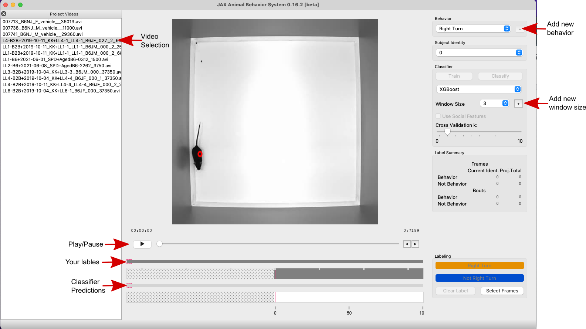
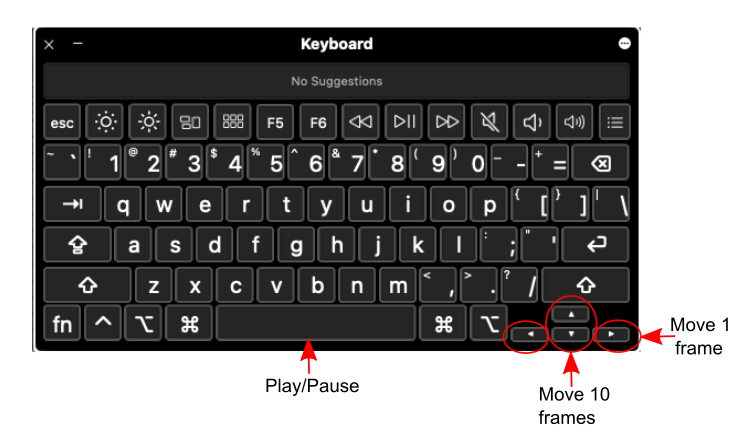
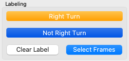
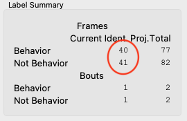
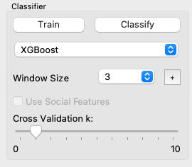
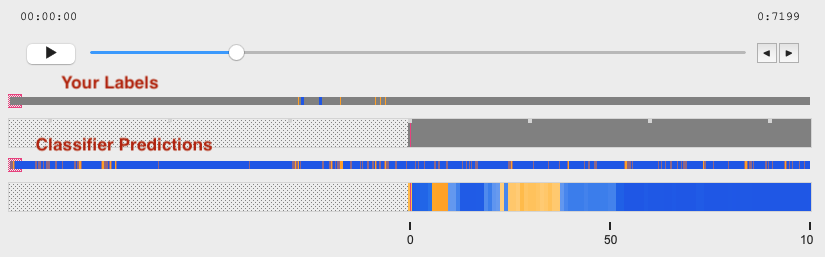

The JABS Interface
#####

Once the GUI has launched, you can Click the ‘File’ tab and select ‘Open Project’ and open your project folder. This will load the videos and prompt you to enter the name of the behavior you want to label. (You will be able to add multiple other behaviors for labeling as desired.)
On the left hand panel are the project videos. You can select the video to label by clicking on it. If the video has multiple mice, you can select the mouse identity to label using the dropdown menu for Subject Identity on the right hand of the GUI. 

You can play and pause the video either by using the play button on the GUI or by pressing the space bar on your keyboard. You can scan frame by frame through the video by pressing the left and right arrow keys to go backwards and forwards, respectively. You can scan more quickly through the video 10 frames at a time using the up and down arrow keys to go backwards and forwards, respectively.

    
    
Labeling in JABS
#####

To label a set of frames, click the button ‘Select Frames’ in the Labeling panel at the bottom right corner of the GUI. Then select the frames to be labeled either by playing and pausing, going frame by frame, or by going 10 frames at a time. Once you have made your selection, you can click the yellow button with the behavior name to label the frames as the behavior. To label the frames as Not behavior, click the blue button. To remove a label from frames, click the ‘Select Frames’ button, select the frames you wish to unlabel, and then click the ‘Clear Label’ button. 

Training the Classifier
#####

In order to train a classifier, at least 20 frames of behavior and 20 frames of not behavior must be labeled for at least 2 videos.

Adjust the ‘Cross validation k’ slider for the amount of videos that have enough labels (the ‘Train’ button should be selectable). You can change the Classifier type between Random Forest, Gradient Boosting, and XGBoost with the drop down menu. 
You can change the window size for the feature generation either by the drop down menu showing the available calculated window sizes, or by adding a new window size by clicking the ‘+’ button next to the drop down menu. Window sizes are statistical measures of all the per-frame features inside that window. For example, if the window size is 5, JABS looks at 5 frames before and after a labeled frame, computes window features using all those per-frame features, and then trains using window features. For a shorter behavior, the ideal window size may be small, while for a longer behavior, it may be large.

Once you are ready to train the classifier, click the train button. If the features for the selected window size have not been calculated before hand, this process may take longer. Once training has finished, the command line output will look like this:

.. image:: images/commandline.png
    :width: 600px
    :align: center
    :alt: alternate text

You have now trained your first classifier. The Summary table contains accuracy measures for the k-fold cross validation on each video with enough labels. It then summarizes the mean accuracy and f1beta scores for the video set. 

Now, you can classify the frames in your video by pressing the ‘Classify’ button in the GUI. The bottom row of the labels shows the classifier’s prediction of behavior for each frame.

You should now go through the classifier’s predictions and fix false positives or false negatives you come across by labeling those frames correctly. Once you’ve labeled some more frames, you can retrain the classifier and then reclassify to see the new classifier’s predictions. You can then continue to iteratively correct, train, and predict until you are satisfied with your classifier. You can adjust window size and classifier type to see what gives you the best performance. Once you are satisfied with the classifier you can export the training file to infer on other videos. Click on the ‘File’ tab and then ‘Export Training Data’. This will export an hdf5 file into your project folder named ‘<behavior_name>_training_<date_and_time>.h5’. This training file can be used to classify behavior in other videos. 

In order to classify behavior in other videos not in the project folder, open up the command line and set your working directory to the JABS-behavior-classifier folder and activate the environment. 

.. code-block::  console

    source jabs.venv/bin/activate
    #for window:
    jabs.venv\Scripts\activate.bat

To classify the video :

.. code-block:: console

    python classify.py --training <Training_data_file> --input-pose <Posefile_for_video> --out-dir <Directory_to_save_to>

This will save the inference file in the directory listed for ‘--out-dir’.  
