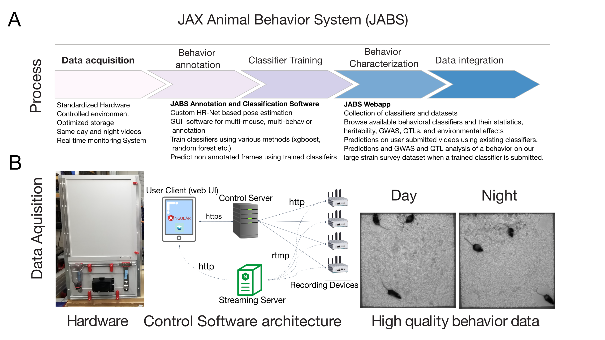

Welcome to JABS documentation!
===================================

**JABS** (JAX Animal Behavior System) is an integrated rodent phenotyping platform to the
community for data acquisition, machine learning based behavior annotation, classifier sharing
and automated genetic analysis.

Check out the :doc:`usage` section for further information, including
how to :ref:`installation` the project.

.. note::

   This project is under active development.

Contents
--------

.. toctree::

   usage
   10 minutes to JABS
   Lesson-2
   Lesson-3
   
   

