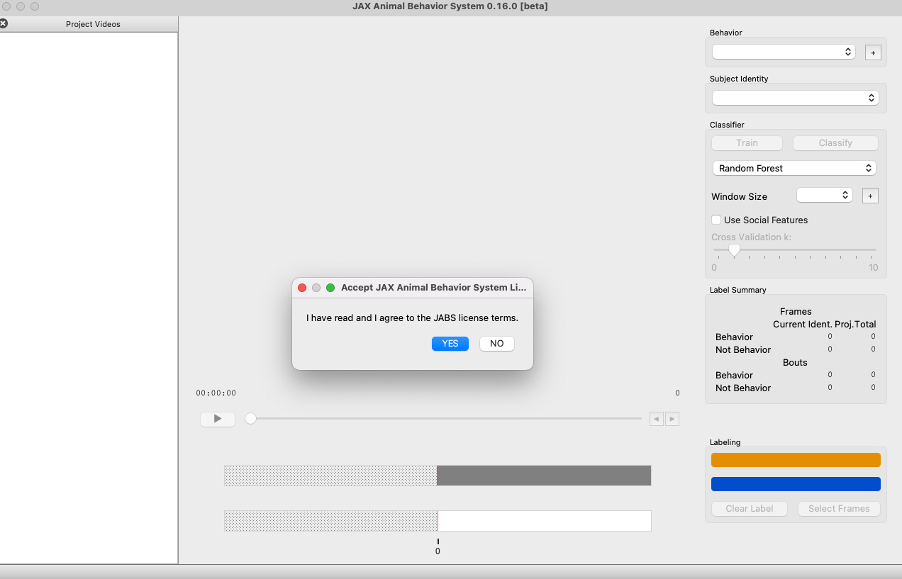

# Set up

<a id="installation"></a>

## Installation

### Creating the Virtual Environment

You will need to create the virtual environment before you can run the labeler 
for the first time. The following commands will create a new Python3 virtual 
environment, activate it, and install the required packages. Note, your python 
executable may be named `python` or `python3` depending on your installation.

```console
python -m venv jabs.venv
source jabs.venv/bin/activate
pip install git+https://github.com/KumarLabJax/JABS-behavior-classifier.git
```

### Activating

The virtual environment must be activated before you can run the labeling 
interface. To activate, run the following command:

```console
source jabs.venv/bin/activate
```

### Deactivating

The virtual environment can be deactivated if you no longer need it:

```console
deactivate
```

### Enabling XGBoost Classifier

The XGBoost Classifier has a dependency on the OpenMP library. This does
not ship with MacOS. XGBoost should work "out of the box" on other platforms. 
On MacOS, you can install libomp with Homebrew (preferred) with the following 
command `brew install libomp`.

## Launching JABS GUI

To launch JABS from the command prompt, open a command prompt in the JABS 
directory and run the following commands (replace `jabs.venv\Scripts\activate.bat`
with `source jabs.venv/bin/activate` if you are using macOS or Linux):

```console
jabs.venv\Scripts\activate.bat
jabs
```

If everything runs smoothly, you should see a JABS startup window like the following:



## Preparing the JABS Project

Once the JABS environment is activated, prepare your project folder. The folder should contain the videos for labeling and the corresponding pose file for each video. 
Once prepared, you may either proceed to open the JABS GUI or initialize the project folder prior to working using jabs-init.

```console
jabs-init <project_dir>
```

This will generate the JABS features for the project for the default window size of 5. The argument ‘-w’ can be used to set the initial window size for feature generation. 

### Starting up 

You can open the JABS GUI with the command:

```console
jabs
```