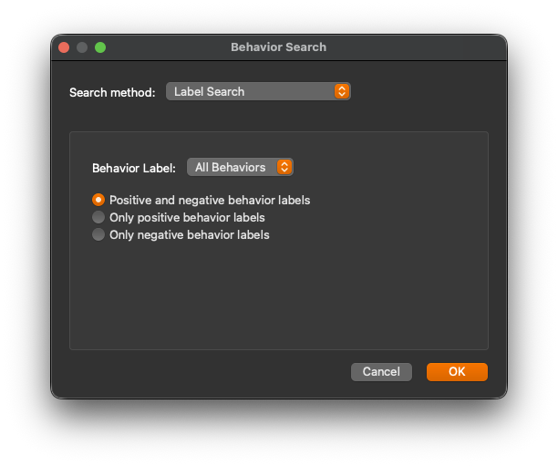

# Behavior Search

JABS includes a powerful Behavior Search tool designed to help users efficiently locate and inspect labeled or predicted bouts of a specific behavior.

## What is Behavior Search?

Behavior Search allows you to quickly find and review all labeled bouts of a specified behavior in your JABS project, or to find all predicted bouts for a behavior using the current classifier. When searching predicted bouts, you can filter by confidence threshold to focus on low-confidence predictions that may need review or correction.

## When to Use Behavior Search

- **Reviewing Labeled Data:** Quickly find all labeled bouts of a behavior to ensure consistency and accuracy in your annotations.
- **Refinement:** After training a classifier, search for low confidence predictions to correct errors or add more labeled data.

## How to Use Behavior Search

1. **Open the Behavior Search Dialog:**
   - Use the Ctrl+F (Cmd+F on Mac) shortcut or select Search Behaviors in the Tools menu.
2. **Select Search Mode:**
   - Label Search: find user-labeled bouts
   - Prediction Search: find classifier predictions
   - Timeline Annotation Search: find timeline annotations
3. **Select a Behavior:**
   - Choose the behavior you want to search for from the dropdown menu (for Label or Prediction Search).
4. **Configure Search Options:**
   - Set filters such as minimum confidence, minimum/maximum duration, etc.
   - Search options may vary based on the selected search mode.
5. **Run the Search:**
   - Click "OK" to scan all project videos for candidate bouts.
6. **Review Results:**
   - The video list will be updated to display the number of search hits next to each video name. 
   - A search toolbar will appear at the top of the main window, showing the total number of results found, as well as navigation buttons to move between results.
   - Search hits will also be highlighted in the timeline view.
7. **Label or Edit Bouts:**
   - Use the standard controls to add or update labels as needed.

