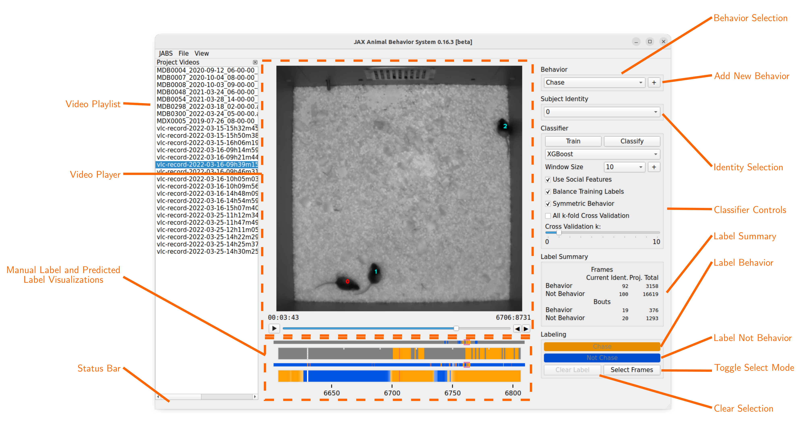
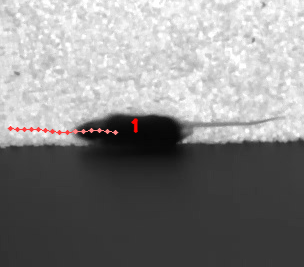
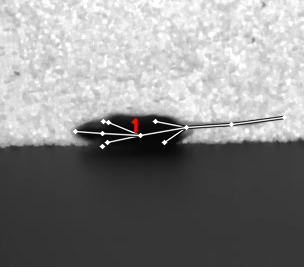
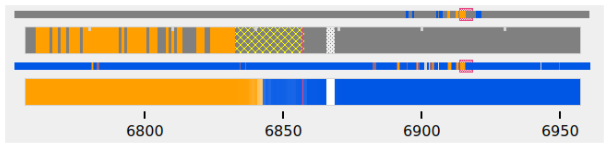
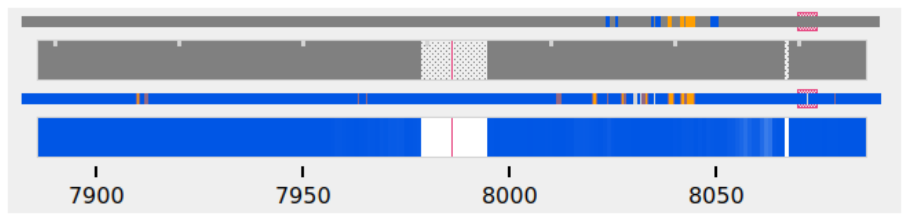

# JABS User Guide

## The JABS Project Directory

A JABS project is a directory of video files and their corresponding pose
estimation files. The first time a project directory is opened in JABS, it will
create a subdirectory called "rotta", which contains various files created by
JABS to save project state, including labels and current predictions.

### Example JABS project directory listing:

```text
NV11-CBAX2+2019-07-26+MDX0009_2019-07-26_08-00-00_500.avi
NV11-CBAX2+2019-07-26+MDX0009_2019-07-26_08-00-00_500_pose_est_v3.h5
NV11-CBAX2+2019-07-26+MDX0009_2019-07-26_09-00-00_500.avi
NV11-CBAX2+2019-07-26+MDX0009_2019-07-26_09-00-00_500_pose_est_v3.h5
NV11-CBAX2+2019-07-26+MDX0009_2019-07-26_10-00-00_500.avi
NV11-CBAX2+2019-07-26+MDX0009_2019-07-26_10-00-00_500_pose_est_v3.h5
NV11-CBAX2+2019-07-26+MDX0009_2019-07-26_11-00-00_500.avi
NV11-CBAX2+2019-07-26+MDX0009_2019-07-26_11-00-00_500_pose_est_v3.h5
NV11-CBAX2+2019-07-26+MDX0009_2019-07-26_12-00-00_500.avi
NV11-CBAX2+2019-07-26+MDX0009_2019-07-26_12-00-00_500_pose_est_v3.h5
NV11-CBAX2+2019-07-26+MDX0009_2019-07-26_13-00-00_500.avi
NV11-CBAX2+2019-07-26+MDX0009_2019-07-26_13-00-00_500_pose_est_v3.h5
NV11-CBAX2+2019-07-26+MDX0009_2019-07-26_14-00-00_500.avi
NV11-CBAX2+2019-07-26+MDX0009_2019-07-26_14-00-00_500_pose_est_v3.h5 rotta
```

## Initializing  A JABS Project Directory

The first time you open a project directory in with JABS it will create the "
rotta" subdirectory. Features will be computed the first time the "Train" button
is clicked. This can be very time consuming depending on the number and length
of videos in the project directory.

The initialize_project.py script can also be used to initialize a project
directory before it is opened in the JABS GUI. This script checks to make sure
that a pose file exists for each video in the directory, and that the pose file
and video have the same number of frames. Then, after these basic checks, the
script will compute features for all of the videos in the project. Since
initialize_project.py can compute features for multiple videos in parallel, it
is significantly faster than doing so through the GUI during the training
process.

### initialize_project.py usage:

```text
usage: initialize_project.py [-h] [-f] [-p PROCESSES] [-w WINDOW_SIZE]
                             [--force-pixel-distances]
                             project_dir

positional arguments:
  project_dir

optional arguments:
  -h, --help            show this help message and exit
  -f, --force           recompute features even if file already exists
  -p PROCESSES, --processes PROCESSES
                        number of multiprocessing workers
  -w WINDOW_SIZE        Specify window sizes to use for computing window features. Argument can
                        be repeated to specify multiple sizes (e.g. -w 2 -w 5). Size is number
                        of frames before and after the current frame to include in the window.
                        For example, '-w 2' results in a window size of 5 (2 frames before, 2
                        frames after, plus the current frame). If no window size is specified,
                        a default of 5 will be used.
  --force-pixel-distances
                        use pixel distances when computing features even if project supports cm
```

### example initialize_project.py command

The following command runs the initialize_project.py script to compute features
using window sizes of 2, 5, and 10. The script will use up to 8 processes for
computing features (-p8). If no -p argument is passed, initialize_project.py
will use up to 4 processes.

`./initialize_project.py -p8 -w2 -w5 -w10 <path/to/project/dir>`

## The Rotta Directory

JABS creates a subdirectory called "rotta" inside the project directory (this
directory is called "rotta" for historical reasons and may change prior to the
1.0.0 release of JABS). This directory contains app-specific data such as
project settings, generated features, user labels, cache files, and the latest
predictions.

project.json This file contains project settings and metadata.

### rotta/annotations

This directory stores the user's labels, stored in one JSON file per labeled
video.

### rotta/archive

This directory contains archived labels. These are compressed files (gzip)
containing labels for behaviors that the user has removed from the project.
Rotta only archives labels. Trained classifiers and predictions are deleted if a
user removes a behavior from a project.

### rotta/cache

Files cached by JABS to speed up performance. Some of these files may not be
portable, so this directory should be deleted if a JABS project is copied to a
different platform.

### rotta/classifiers

This directory contains trained classifiers. Currently, these are stored in
Python Pickle files and should be considered non-portable.

### rotta/features

This directory contains the computed features. There is one directory per
project video, and within each video directory there will be one feature
directory per identity. Feature files are usually portable, but JABS may need
to recompute the features if they were created with a different version of
JABS.

### rotta/predictions

This directory contains prediction files. There will be one subdirectory per
behavior containing one prediction file per video. Prediction files are
automatically opened and displayed by JABS if they exist. Prediction files are
portable, and are the same format as the output of the command line classifier
tool (`classify.py`).

## GUI

### Main Window



- **Behavior Selection:** Select current behavior to label
- **Add New Behavior Button:** Add new behavior label to project
- **Identity Selection:** Select subject mouse to label (subject can also be
  selected by clicking on mouse in the video)
- **Classifier Controls:** Configure and train classifier. Use trained
  classifier to infer classes for unlabeled frames. See "Classifier Controls"
  section for more details.
- **Label Summary:** Counts of labeled frames and bouts for the subject identity
  in the current video and across the whole project.
- **Label "Behavior" Button:** Label current selection of frames as showing
  behavior. This button is labeled with the current behavior name.
- **Label "Not Behavior" Button:** Label current selection of frames as not
  showing behavior This button is labeled with "Not <current behavior name>".
- **Clear Selection Button:** remove labels from current selection of frames
- **Toggle Select Mode Button:** toggle select mode on/off (turning select mode
  on will begin selecting frames starting from that point)
- **Video Playlist:** list of videos in the current project. Click a video name
  to make it the active video.
- **Video Player:** Displays the current video. See "Video Player" section for
  more information.
- **Manual Label and Predicted Label Visualizations:** see "Label
  Visualizations" for more information.
- **Status Bar:** Displays periodic status messages.

### Classifier Controls


- **Train Button:** Train the classifier with the current parameters. This
  button is disabled until minimum number of frames have been labeled for a
  minimum number of mice (increasing the cross validation k parameter increases
  the minimum number of labeled mice)
- **Classify Button:** Infer class of unlabeled frames. Disabled until
  classifier is trained. Changing classifier parameters may require retraining
  before the Classify button becomes active again.
- **Classifier Type Selection:** Users can select from a list of supported
  classifiers.
- **Window Size Selection:** Number of frames on each side of the current frame
  to include in window feature calculations for that frame. A "window size" of 5
  means that 11 frames are included into the window feature calculations for
  each frame (5 previous frames, current frame, 5 following frames).
- **New Window Size:** Add a new window size to the project.
- **Cross Validation Slider:** Number of "Leave One Out" cross validation
  iterations to run while training.
- **Social Feature Toggle:** Turn on/off social features (disabled if project
  includes pose file version 2). Allows training a classifier backwards
  compatible with V2 pose files using V3 or higher poses.

### Label and Prediction Visualizations


- **Manual Labels (sliding window):** Displays manually assigned labels for a
  sliding window of frames. The window range is the current frame +/-50 frames.
  Orange indicates frames labeled as showing the behavior, blue indicates frames
  labeled as not showing the behavior. Unlabeled frames are colored gray.
- **Manual Labels (global view):** Displays a zoomed out view of the manual
  labels for the entire video
- **Predicted Classes (sliding window):** Displays predicted classes (if the
  classifier has been run). Color opacity indicates prediction probability for
  the predicted class. Manually assigned labels are also displayed with
  probability of 100%.
- **Predicted Class (global view):** Displays a zoomed out view of the predicted
  classes for the entire video.
- **Sliding Window Indicator:** highlights the section of the global views that
  correspond to the frames displayed in the "sliding window" views.s

### Menu

- **JABS→About:** Display About Dialog
- **JABS→User Guide:** Display User Guide
- **JABS→Quit JABS:** Quit Program
- **File→Open Project:** Select a project directory to open. If a project is
  already opened, it will be closed and the newly selected project will be
  opened.
- **File→Export Training Data:** Create a file with the information needed to
  share a classifier. This exported file is written to the project directory and
  has the form `<Behavior_Name>_training_<YYYYMMDD_hhmmss>.h5`. This file is
  used as one input for the `classify.py` script.
- **View→View Playlist:** can be used to hide/show video playlist
- **View→Show Track:** show/hide track overlay for the subject. The track
  overlay shows the nose position for the previous 5 frames and the next 10
  frames. The nose position for the next 10 frames is colored red, and the
  previous 5 frames it is a shade of pink.
- **View→Overlay Pose:** toggle the overlay of the pose on top of the subject
  mouse
- **View→Overlay Landmarks:** toggle the overlay of arena landmarks over the
  video.

**Track Overlay Example:**  


**Pose Overlay Example:**  


## Labeling

This section describes how a user can add or remove labels. Labels are always
applied to the subject mouse and the current subject can be changed at any time.
A common way to approach labeling is to scan through the video for the behavior
of interest, and then when the behavior is observed select the mouse that is
showing the behavior. Scan to the start of the behavior, and begin selecting
frames. Scan to the end of the behavior to select all of the frames that belong
to the bout, and click the label button.

### Selecting Frames

When "Select Mode" is activated, JABS begins a new selection starting at that
frame. The current selection is from the selection start frame through the
current frame. Applying a label, or removing labels from the selection clears
the current selection and leaves "Select Mode".

The current selection range is shown on the "Manual Labels" display:  
  
Clicking the "Select Frames" button again or pressing the Escape key will
unselect the frames and leave select mode without making a change to the labels.

### Applying Labels

The "Label Behavior Button" will mark all of the frames in the current selection
as showing the behavior. The "Label Not Behavior" button will mark all of the
frames in the current selection as not showing the behavior. Finally, the "Clear
Labels" button will remove all labels from the currently selected frames.

### Keyboard Shortcuts

Using the keyboard controls can be the fastest way to label.

#### Navigation Keyboard Controls

The arrow keys can be used for stepping through video. The up arrow skips ahead
10 frames, and the down arrow skips back 10 frames. The right arrow advances one
frame, and the left arrow goes back one frame.

#### Labeling  Controls

The z, x, and c keys can be used to apply labels.

**If in select mode:**

- **z:** label current selection as "behavior"
- **x:** clear labels from current selection
- **c:** label current selection as "not behavior"

**If not in select mode:**

- **z, x, c:** start selecting frames.

## Identity Gaps

Identities can have gaps if the mouse becomes obstructed or the pose estimation
failed for those frames. In the manual label visualization, these gaps are
indicated with a pattern fill instead of the solid gray/orange/blue colors. In
the predicted class visualization, the gaps are colored white.



## All Keyboard Shortcuts

### File Menu

Actions under the file menu have keyboard shortcuts.

- Control Q (Command Q on Mac) quit JABS
- Control T (Command T on Mac) export training data

### Navigation

- left arrow: move to previous frame
- right arrow: move to next frame
- up arrow: move forward 10 frames (TODO: make configurable)
- down arrow: move back 10 frames (TODO: make configurable)
- space bar: toggle play/pause

### Labeling

while in select mode:

- z: label current selection <behavior>and leave select mode
- x: clear current selection labels and leave select mode
- c: label current selection not <behavior> and leave select mode
- Escape: exit select mode without applying/clearing labels for current
  selection

while not in select mode:

- z, x, c: enter select mode

### Other

- t: toggle track overlay for subject
- p: toggle pose overlay for subject
- l: toggle landmark overlay

## The Command Line Classifier

JABS includes a script called `classify.py`, which can be used to classify a
single video from the command line.

```text
usage: classify.py COMMAND COMMAND_ARGS

commands:
 classify   classify a pose file
 train      train a classifier that can be used to classify multiple pose files

See `classify.py COMMAND --help` for information on a specific command.
```

```text
usage: classify.py classify [-h] [--random-forest | --gradient-boosting | --xgboost]
                            (--training TRAINING | --classifier CLASSIFIER) --input-pose
                            INPUT_POSE --out-dir OUT_DIR [--fps FPS]
                            [--feature-dir FEATURE_DIR]

optional arguments:
  -h, --help            show this help message and exit
  --fps FPS             frames per second, default=30
  --feature-dir FEATURE_DIR
                        Feature cache dir. If present, look here for features before computing.
                        If features need to be computed, they will be saved here.

required arguments:
  --input-pose INPUT_POSE
                        input HDF5 pose file (v2, v3, or v4).
  --out-dir OUT_DIR     directory to store classification output

optionally override the classifier specified in the training file:
 Ignored if trained classifier passed with --classifier option.
 (the following options are mutually exclusive):
  --random-forest       Use Random Forest
  --gradient-boosting   Use Gradient Boosting
  --xgboost             Use XGBoost

Classifier Input (one of the following is required):
  --training TRAINING   Training data h5 file exported from JABS
  --classifier CLASSIFIER
                        Classifier file produced from the `classify.py train` command
```

```text
usage: classify.py train [-h] [--random-forest | --gradient-boosting | --xgboost]
                         training_file out_file

positional arguments:
  training_file        Training h5 file exported by JABS
  out_file             output filename

optional arguments:
  -h, --help           show this help message and exit

optionally override the classifier specified in the training file:
 (the following options are mutually exclusive):
  --random-forest      Use Random Forest
  --gradient-boosting  Use Gradient Boosting
  --xgboost            Use XGBoost
```

Note: xgboost may be unavailable on Mac OS if libomp is not installed.
See `classify.py classify --help` output for list of classifiers supported in
the current execution environment.

Note: fps parameter is used to specify the frames per second (used for scaling
time unit for speed and velocity features from "per frame" to "per second").

## File Formats

This section documents the format of JABS output files that may be needed for
downstream analysis.

### Inference File

An inference file represents the predicted classes for each identity present in
one video file.

#### Location

The prediction files are saved
in `<JABS project dir>/rotta/predictions/<behavior_name>/<video_name>.h5` if
they were generated by the JABS GUI. The `classify.py` script saves inference
files in `<out-dir>/<behavior_name>/<video_name>.h5`

#### Contents

The H5 file contains one group, called "predictions". This group contains three
datasets

predictions

- predicted_class
- probabilities
- identity_to_track

The file also has some attributes:

- version: This attribute contains an integer version number, and will be
  incremented if an incompatible change is made to the file format.
- source_pose_major_version: integer containing the major version of the pose
  file that was used for the prediction

##### predicted_class

- dtype: 8-bit integer
- shape: #identities x #frames

This dataset contains the predicted class. Each element contains one of three
values:

- 0: "not behavior"
- 1: "behavior"
- -1: "identity not present in frame".

##### probabilities

- dtype: 32-bit floating point
- shape: #identities x #frames

This dataset contains the probability (0.0-1.0) of each prediction. If there is
no prediction (the identity doesn't exist at a given frame) then the prediction
probability is 0.0.

##### identity_to_track

- dtype: 32-bit integer
- shape: #identities x #frames

This dataset maps each JABS-assigned identity (Pose version 3) back to the
original track ID from the pose file at each frame. -1 indicates the identity
does not map to a track for that frame. For Pose File Version 4 and greater,
JABS uses the identity assignment contained in the pose file. For pose version
2, there will be exactly one identity (0).
