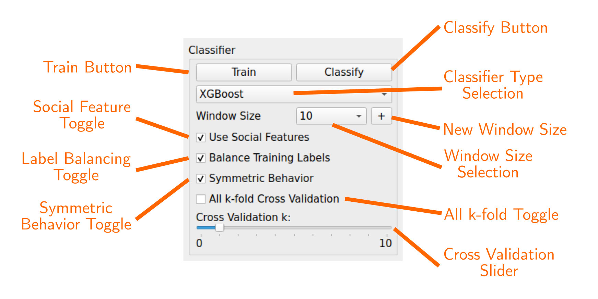
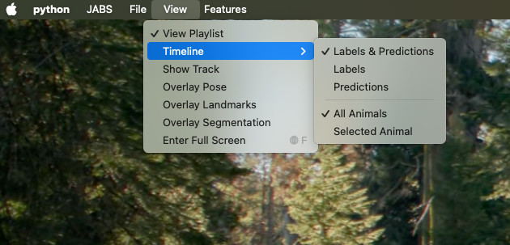
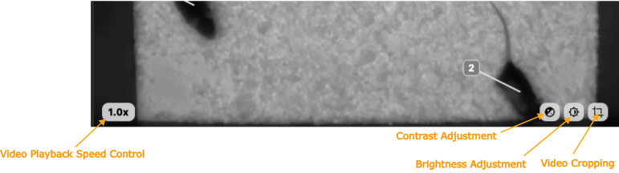
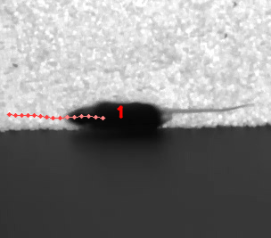
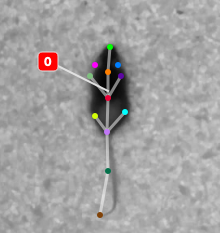
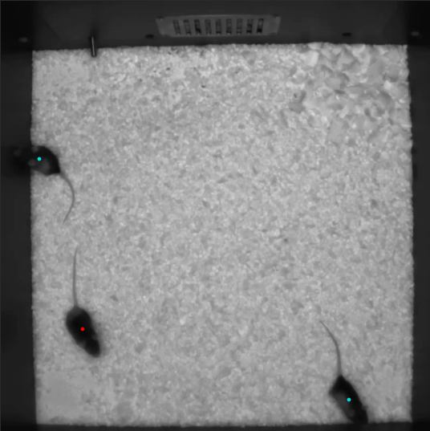

# GUI

## Main Window

- **Behavior Selection:** Select current behavior to label
- **Add New Behavior Button:** Add new behavior label to project
- **Identity Selection:** Select subject mouse to label (subject can also be selected by clicking on mouse in the video)
- **Classifier Controls:** Configure and train classifier. Use trained classifier to infer classes for unlabeled frames. See "Classifier Controls" section for more details.
- **Label Summary:** Counts of labeled frames and bouts for the subject identity in the current video and across the whole project.
- **Label "Behavior" Button:** Label current selection of frames as showing behavior. This button is labeled with the current behavior name.
- **Label "Not Behavior" Button:** Label current selection of frames as not showing behavior. This button is labeled with `Not <current behavior name>`.
- **Clear Selection Button:** remove labels from current selection of frames
- **Toggle Select Mode Button:** toggle select mode on/off (turning select mode on will begin selecting frames starting from that point)
- **Video Playlist:** list of videos in the current project. Click a video name to make it the active video.
- **Video Player:** Displays the current video. See "Video Player" section for more information.
- **Manual Label and Predicted Label Visualizations:** see "Label Visualizations" for more information.
- **Status Bar:** Displays periodic status messages.

## Classifier Controls

- **Train Button:** Train the classifier with the current parameters. This button is disabled until minimum number of frames have been labeled for a minimum number of mice (increasing the cross validation k parameter increases the minimum number of labeled mice). When training completes, a training report dialog will display performance metrics including cross-validation results and feature importance rankings.
- **Classify Button:** Infer class of unlabeled frames. Disabled until classifier is trained. Changing classifier parameters may require retraining before the Classify button becomes active again.
- **Classifier Type Selection:** Users can select from a list of supported classifiers.
- **Window Size Selection:** Number of frames on each side of the current frame to include in window feature calculations for that frame. A "window size" of 5 means that 11 frames are included into the window feature calculations for each frame (5 previous frames, current frame, 5 following frames).
- **New Window Size:** Add a new window size to the project.
- **Label Balancing Toggle:** Balances the training data by downsampling the class with more labels such that the distribution is equal.
- **Symmetric Behavior Toggle:** Tells the classifier that the behavior is symmetric. A symmetric behavior is when left and right features are interchangeable.
- **All k-fold Toggle:** Uses the maximum number of cross validation folds. Useful when you wish to compare classifier performance and may have an outlier that can be held-out.
- **Cross Validation Slider:** Number of "Leave One Out" cross validation iterations to run while training.

### Choosing a Classifier Type

JABS supports three machine learning classifier types: **Random Forest**, **CatBoost**, and **XGBoost**. Each has different characteristics that may make it more suitable for your specific use case.

#### Random Forest (Default)

Random Forest is the default classifier and a good starting point for most users.

**Pros:**

- ✅ **Fast training** - Trains quickly, even on large datasets
- ✅ **Well-established** - Mature algorithm with extensive validation
- ✅ **Good baseline performance** - Reliable results across many behavior types
- ✅ **Low memory footprint** - Efficient with system resources

**Cons:**

- ⚠️ **May plateau** - Sometimes reaches a performance ceiling compared to gradient boosting methods
- ⚠️ **Less flexible** - Fewer tuning options than boosting methods
- ⚠️ **Does not handle missing data** - Random Forest does not natively handle missing (NaN) values, so JABS currently replaces all NaNs with 0 during training and classification. This might not be a good choice if your data has many missing values

**Best for:** Quick iterations, initial exploration, behaviors with simpler decision boundaries, or when training time is a priority.

#### CatBoost

CatBoost is a gradient boosting algorithm that can achieve excellent performance, particularly for complex behaviors.

**Pros:**

- ✅ **High accuracy** - Often achieves the best classification performance
- ✅ **Handles missing data natively** - No imputation needed for NaN values
- ✅ **Robust to overfitting** - Built-in regularization techniques
- ✅ **No external dependencies** - Installs cleanly without additional libraries

**Cons:**

- ⚠️ **Slower training** - Takes significantly longer to train than Random Forest
- ⚠️ **Higher memory usage** - May require more RAM during training
- ⚠️ **Longer to classify** - Prediction can be slower on very large datasets

**Best for:** Final production classifiers where accuracy is paramount, complex behaviors with subtle patterns, or when you have time for longer training sessions.

#### XGBoost

XGBoost is another gradient boosting algorithm known for winning machine learning competitions.

**Pros:**

- ✅ **Excellent performance** - Typically matches or exceeds Random Forest accuracy
- ✅ **Handles missing data natively** - Like CatBoost, works with NaN values
- ✅ **Faster than CatBoost** - Better training speed than CatBoost
- ✅ **Widely used** - Extensive community support and documentation

**Cons:**

- ⚠️ **Dependency on libomp** - On macOS, may require separate installation of OpenMP library
- ⚠️ **Slower than Random Forest** - Training takes longer than Random Forest
- ⚠️ **May be unavailable** - If libomp is not installed, XGBoost won't be available as a choice in JABS

**Best for:** When you need better accuracy than Random Forest but faster training than CatBoost, or when you're familiar with gradient boosting methods.

#### Quick Comparison

| Feature | Random Forest | CatBoost | XGBoost |
|---------|--------------|----------|---------|
| **Training Speed** | ⚡⚡⚡ Fast | 🐌 Slow | ⚡⚡ Moderate |
| **Accuracy** | ⭐⭐⭐ Good | ⭐⭐⭐⭐⭐ Excellent | ⭐⭐⭐⭐ Very Good |
| **Missing Data Handling** | Imputation to 0 | Native support | Native support |
| **Setup Complexity** | ✅ Simple | ✅ Simple | ⚠️ May need libomp |
| **Best Use Case** | Quick iterations | Production accuracy | Balanced performance |

#### Recommendations

**Getting Started:** Start with **Random Forest** to quickly iterate and establish a baseline. It trains fast, allowing you to experiment with different labeling strategies and window sizes.

**Optimizing Performance:** Once you've refined your labels and parameters, try **CatBoost** for a potential accuracy boost. The longer training time is worthwhile for your final classifier.

**Alternative:** If CatBoost is too slow or you want something between Random Forest and CatBoost, try **XGBoost** (if available on your system).

**Note:** The actual performance difference between classifiers varies by behavior type and dataset. We recommend testing multiple classifiers on your specific data to find the best option for your use case.

### Training Reports

When training completes, JABS displays a training report in a modal dialog. The report includes:

- **Training summary** - behavior name, classifier type, distance unit, and training time
- **Label counts** - Number of labeled frames and bouts for both behavior and not-behavior classes
- **Cross-validation results** - Performance metrics (accuracy, precision, recall, F1 score) for each leave-one-out iteration, along with which video/identity was held out as the test set
- **Feature importance** - Top 20 most important features from the final trained classifier

The training report is also saved as a Markdown file in the `jabs/training_logs` directory within your project. The filename includes the behavior name and timestamp (e.g., `Grooming_20260102_143022_training_report.md`). These reports provide a permanent record of your training sessions and can be useful for:

- Comparing different classifier configurations
- Identifying problematic videos or identities with poor cross-validation performance
- Understanding which features contribute most to behavior classification
- Documenting your analysis workflow

## Timeline Visualizations

- **Manual Labels (sliding window):** Displays manually assigned labels for a sliding window of frames. The window range is the current frame +/-50 frames. Orange indicates frames labeled as showing the behavior, blue indicates frames labeled as not showing the behavior. Unlabeled frames are colored gray.
- **Manual Labels (global view):** Displays a zoomed out view of the manual labels for the entire video
- **Predicted Classes (sliding window):** Displays predicted classes (if the classifier has been run). Color opacity indicates prediction probability for the predicted class.
- **Predicted Class (global view):** Displays a zoomed out view of the predicted classes for the entire video.
- **Sliding Window Indicator:** highlights the section of the global views that correspond to the frames displayed in the "sliding window" views.

By default, the Timeline shows manual labels and predicted behaviors for the current subject animal. The Timeline can be toggled to show all subjects by selecting View->Timeline->All Animals in the menu bar. The Timeline can also be configured to show only manual labels or only predicted labels. If "All Animals" is selected, the Timeline will show which set of labels and predictions belong to the subject animal by drawing a colored border around them.

### Timeline Menu

  

### Example Timeline with "Labels & Predictions" and "All Animals" selected

## Video Controls

Mousing over the video player will display a control overlay with the following controls:

- **Video Playback Speed Controls:** Controls the speed of video playback. Clicking this control will open a menu with options for playback speed. The default speed is 1x.
- **Video Cropping:** Allows the user to crop the video to a specific region of interest. After clicking the cropping control, the user can click and drag a rectangular selecting tool to select the region of interest. The video will be cropped to the selection, and scaled to fill the available player area. If the video is currently cropped, the cropping control will be replaced with a "Reset Cropping" control, which will reset the cropping to the original video size.
- **Brightness Adjustment:** Allows the user to adjust the brightness of the video. Clicking this control will open a slider that can be used to adjust the brightness.
- **Contrast Adjustment:** Allows the user to adjust the contrast of the video. Clicking this control will open a slider that can be used to adjust the contrast.

Clicking the Brightness or Contrast controls will reset the brightness or contrast to the default value before displaying the slider control. Clicking the video or moving the mouse off the video frame will dismiss the slider control.

## Menu

- **JABS→About:** Display About Dialog
- **JABS→User Guide:** Display User Guide
- **JABS→Quit JABS:** Quit Program
- **File→Open Project:** Select a project directory to open. If a project is already opened, it will be closed and the newly selected project will be opened.
- **File→Export Training Data:** Create a file with the information needed to share a classifier. This exported file is written to the project directory and has the form `<Behavior_Name>_training_<YYYYMMDD_hhmmss>.h5`. This file is used as one input for the `jabs-classify` script.
- **File→Archive Behavior:** Remove behavior and its labels from project. Labels are archived in the `jabs/archive` directory.
- **File→Prune Project:** Remove videos and pose files that are not labeled.
- **View:** Menu to control various display options.
  - **View→View Playlist:** can be used to hide/show video playlist
  - **View→Timeline:** Menu to control the timeline display.
  - **View→Label Overlay:** Control the floating display of manual labels or predicted classes.
  - **View→Identity Overlay:** Configure the identity overlay mode.
  - **View→Show Track:** show/hide track overlay for the subject. The track overlay shows the nose position for the previous 5 frames and the next 10 frames. The nose position for the next 10 frames is colored red, and the previous 5 frames it is a shade of pink.
  - **View→Overlay Pose:** toggle the overlay of the pose on top of the subject mouse
  - **View→Overlay Landmarks:** toggle the overlay of arena landmarks over the video.
- **Features:** Menu item for controlling per-behavior classifier settings. Menu items are disabled when at least 1 pose file in the project does not contain the data to calculate features.
  - **Features→CM Units:** toggle using CM or pixel units (Warning! Changing this will require features to be re-calculated)
  - **Features→Enable Window Features:** toggle using statistical window features
  - **Features→Enable Signal Features:** toggle using fft-based window features
  - **Features→Enable Social Features:** toggle using social features (v3+ projects)
  - **Features→Enable Corners Features:** toggle using arena corner features (v5+ projects with arena corner static object)
  - **Features→Enable Lixit Features:** toggle using lixit features (v5+ projects with lixit static object)
  - **Features→Enable Food_hopper Features:** toggle using food hopper features (v5+ projects with food hopper static object)
  - **Features→Enable Segmentation Features:** toggle using segmentation features (v6+ projects)

## Overlays

### Track Overlay Example

### Pose Overlay Example

### Pose Overlay Keypoint Legend

### Identity Overlay

JABS offers several ways to overlay mouse identities on the video. Choose a mode from View → Identity Overlay.

In all modes, you can select the subject directly in the video: click inside the convex hull of body keypoints (excluding the tail) to select that animal. You can also click the floating identity label. With the Bounding Box overlay, clicking the tab selects the animal. These options are in addition to the Identity dropdown in the main window and the Shift+↑ / Shift+↓ keyboard shortcuts.

#### Floating

#### Centroid

#### Minimalist

#### Bounding Box

