# JABS User Guide

## Shortcuts

- [The JABS Project Directory](#the-jabs-project-directory)
  - [Initializing A JABS Project Directory](#initializing-a-jabs-project-directory)
- [The JABS Main Window](#main-window)
- [Keyboard Shortcuts](#all-keyboard-shortcuts)
- [Labeling](#labeling)
  - [Selecting Frames](#selecting-frames)
  - [Applying Labels](#applying-labels)
  - [Labeling Keyboard Shortcuts](#keyboard-shortcuts)

## The JABS Project Directory

A JABS project is a directory of video files and their corresponding pose
estimation files. The first time a project directory is opened in JABS, it will
create a subdirectory called "jabs", which contains various files created by
JABS to save project state, including labels and current predictions.

### Example JABS Project Directory listing:

```text
VIDEO_1.avi
VIDEO_1_pose_est_v3.h5
VIDEO_2.avi
VIDEO_2_pose_est_v3.h5
VIDEO_3.avi
VIDEO_3_pose_est_v3.h5
VIDEO_4.avi
VIDEO_4_pose_est_v3.h5
VIDEO_5.avi
VIDEO_5_pose_est_v3.h5
VIDEO_6.avi
VIDEO_6_pose_est_v3.h5
VIDEO_7.avi
VIDEO_7_pose_est_v3.h5
jabs/
```

## Initializing a JABS Project Directory

The first time you open a project directory with JABS it will create the `jabs`
subdirectory. Features will be computed the first time the "Train" button is
clicked. This can be time-consuming depending on the number and length of videos
in the project directory.

The `jabs-init` script can also be used to initialize a project directory before
it is opened in the JABS GUI. This script checks to make sure that a pose file
exists for each video in the directory, and that the pose file and video have
the same number of frames. Then, after these basic checks, the script will
compute features for all the videos in the project. Since `jabs-init` can
compute features for multiple videos in parallel, it is significantly faster
than doing so through the GUI during the training process.

### jabs-init Usage:

```text
usage: jabs-init [-h] [-f] [-p PROCESSES] [-w WINDOW_SIZE] [--force-pixel-distances] [--metadata METADATA]
                 [--skip-feature-generation]
                 project_dir

positional arguments:
  project_dir

options:
  -h, --help            show this help message and exit
  -f, --force           recompute features even if file already exists, replace existing project metadata
  -p PROCESSES, --processes PROCESSES
                        number of multiprocessing workers
  -w WINDOW_SIZE        Specify window sizes to use for computing window features. Argument can be repeated to specify
                        multiple sizes (e.g. -w 2 -w 5). Size is number of frames before and after the current frame to
                        include in the window. For example, '-w 2' results in a window size of 5 (2 frames before, 2
                        frames after, plus the current frame). If no window size is specified, a default of 5 will be
                        used.
  --force-pixel-distances
                        use pixel distances when computing features even if project supports cm
  --metadata METADATA   path to a JSON file containing project metadata to be validated and injected into the project
  --skip-feature-generation
                        Skip feature calculation and only initialize/validate the project
```

### Example jabs-init Command

The following command runs the `jabs-init` script to compute features using
window sizes of 2, 5, and 10. The script will use up to 8 processes for
computing features (-p8). If no -p argument is passed, `jabs-init` will use up
to 4 processes.

`jabs-init -p8 -w2 -w5 -w10 <path/to/project/dir>`

### Project Metadata

The --metadata argument can be used to pass a JSON file containing project
metadata. This file has the following schema:

```json
{
    "$schema": "https://json-schema.org/draft/2020-12/schema",
    "$id": "urn:jax.org:schemas:jabs:project-metadata:v1",
    "title": "JABS Project Metadata Schema",
    "type": "object",
    "properties": {
        "project": {"$ref": "#/$defs/project"},
        "videos": {
            "type": "object",
            "additionalProperties": {"$ref": "#/$defs/video"},
            "propertyNames": {"pattern": "^[^/]{1,251}\\.(avi|mp4)$"}
        }
    },
    "required": [],
    "additionalProperties": false,
    "$defs": {
        "primitive": {"anyOf": [{"type": "string"}, {"type": "number"}, {"type": "boolean"}]},
        "project": {
            "type": "object",
            "properties": {"nwb": {"$ref": "#/$defs/nwb"}},
            "additionalProperties": {"$ref": "#/$defs/primitive"}
        },
        "video": {
            "type": "object",
            "properties": {"nwb": {"$ref": "#/$defs/nwb"}},
            "required": [],
            "additionalProperties": {"$ref": "#/$defs/primitive"}
        },
        "nwb": {
            "type": "object",
            "properties": {
                "nwb_version": {"type": "string"},
                "session_description": {"type": "string", "minLength": 1},
                "identifier": {"type": "string", "minLength": 1},
                "session_start_time": {"type": "string", "format": "date-time"},
                "file_create_date": {
                    "type": "array",
                    "items": {"type": "string", "format": "date-time"},
                    "minItems": 1
                },
                "general": {"$ref": "#/$defs/general"},
                "analysis": {
                    "description": "Lab-specific and custom analysis results. Free-form by design.",
                    "type": "object",
                    "additionalProperties": true
                }
            },
            "required": [],
            "additionalProperties": true
        },
        "general": {
            "type": "object",
            "properties": {
                "institution": {"type": "string"},
                "lab": {"type": "string"},
                "experimenter": {"type": "array", "items": {"type": "string"}},
                "keywords": {"type": "array", "items": {"type": "string"}},
                "experiment_description": {"type": "string"},
                "data_collection": {"type": "string"},
                "notes": {"type": "string"},
                "pharmacology": {"type": "string"},
                "protocol": {"type": "string"},
                "slices": {"type": "string"},
                "related_publications": {"type": "array", "items": {"type": "string"}},
                "session_id": {"type": "string"},
                "subject": {"$ref": "#/$defs/Subject"},
                "devices": {"type": "array", "items": {"$ref": "#/$defs/Device"}}
            },
            "additionalProperties": false
        },
        "Subject": {
            "type": "object",
            "additionalProperties": false,
            "properties": {
                "subject_id": {"type": "string"},
                "description": {"type": "string"},
                "species": {"type": "string"},
                "strain": {"type": "string"},
                "genotype": {"type": "string"},
                "sex": {"type": "string"},
                "age": {"type": "string"},
                "age_reference": {"type": "string", "enum": ["birth", "gestational"]},
                "date_of_birth": {"type": "string", "format": "date-time"},
                "weight": {"type": "string"}
            }
        },
        "Device": {
            "type": "object",
            "additionalProperties": true,
            "properties": {
                "name": {"type": "string"},
                "description": {"type": "string"},
                "manufacturer": {"type": "string"},
                "model_number": {"type": "string"},
                "model_name": {"type": "string"},
                "serial_number": {"type": "string"}
            },
            "required": ["name"]
        }
    }
}
```

## The JABS Directory

JABS creates a subdirectory called "jabs" inside the project directory. This
directory contains app-specific data such as project settings, generated
features, user labels, cache files, and the latest predictions.

### jabs/project.json

The `project.json` file contains project settings and metadata (behaviors,
feature toggles, etc.).

### jabs/annotations

This directory stores the user's labels, stored in one JSON file per labeled
video.

### jabs/archive

This directory contains archived labels. These are compressed files (gzip)
containing labels for behaviors that the user has removed from the project. JABS
only archives labels. Trained classifiers and predictions are deleted if a user
removes a behavior from a project.

### jabs/cache

Files cached by JABS to speed up performance. Some of these files may not be
portable, so this directory should be deleted if a JABS project is copied to a
different platform.

### jabs/classifiers

This directory contains trained classifiers. Currently, these are stored in
Python Pickle files and should be considered non-portable. While non-portable,
these files can be used alongside `jabs-classify classify --classifier` for
CLI-based prediction on the same machine as the gui running the training.

### jabs/features

This directory contains the computed features. There is one directory per
project video, and within each video directory there will be one feature
subdirectory per identity. Feature files are portable between machines, but JABS
may need to recompute the features if they were created with a different version
of JABS. Feature files contain a version attribute that is incremented when
features are added or changed, or the format of the features file is changed.

### jabs/predictions

This directory contains one HDF5 prediction file per video (e.g., `VIDEO_1.h5`).
Each file has a `/predictions` group with one subgroup per behavior. Prediction
files are automatically opened and displayed by JABS if they exist and are
portable. This is the same format produced by `jabs-classify`.

## GUI

### Main Window

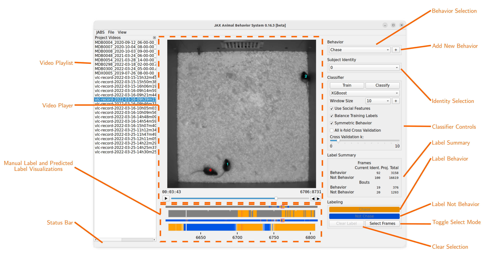

- **Behavior Selection:** Select current behavior to label
- **Add New Behavior Button:** Add new behavior label to project
- **Identity Selection:** Select subject mouse to label (subject can also be
  selected by clicking on mouse in the video)
- **Classifier Controls:** Configure and train classifier. Use trained
  classifier to infer classes for unlabeled frames. See "Classifier Controls"
  section for more details.
- **Label Summary:** Counts of labeled frames and bouts for the subject identity
  in the current video and across the whole project.
- **Label "Behavior" Button:** Label current selection of frames as showing
  behavior. This button is labeled with the current behavior name.
- **Label "Not Behavior" Button:** Label current selection of frames as not
  showing behavior. This button is labeled with `Not <current behavior name>`.
- **Clear Selection Button:** remove labels from current selection of frames
- **Toggle Select Mode Button:** toggle select mode on/off (turning select mode
  on will begin selecting frames starting from that point)
- **Video Playlist:** list of videos in the current project. Click a video name
  to make it the active video.
- **Video Player:** Displays the current video. See "Video Player" section for
  more information.
- **Manual Label and Predicted Label Visualizations:** see "Label
  Visualizations" for more information.
- **Status Bar:** Displays periodic status messages.

### Classifier Controls

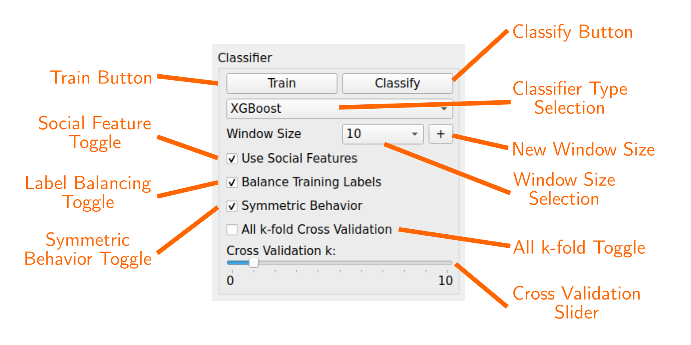

- **Train Button:** Train the classifier with the current parameters. This
  button is disabled until minimum number of frames have been labeled for a
  minimum number of mice (increasing the cross validation k parameter increases
  the minimum number of labeled mice)
- **Classify Button:** Infer class of unlabeled frames. Disabled until
  classifier is trained. Changing classifier parameters may require retraining
  before the Classify button becomes active again.
- **Classifier Type Selection:** Users can select from a list of supported
  classifiers.
- **Window Size Selection:** Number of frames on each side of the current frame
  to include in window feature calculations for that frame. A "window size" of 5
  means that 11 frames are included into the window feature calculations for
  each frame (5 previous frames, current frame, 5 following frames).
- **New Window Size:** Add a new window size to the project.
- **Label Balancing Toggle:** Balances the training data by downsampling the
  class with more labels such that the distribution is equal.
- **Symmetric Behavior Toggle:** Tells the classifier that the behavior is
  symmetric. A symmetric behavior is when left and right features are
  interchangeable.
- **All k-fold Toggle:** Uses the maximum number of cross validation folds.
  Useful when you wish to compare classifier performance and may have an outlier
  that can be held-out.
- **Cross Validation Slider:** Number of "Leave One Out" cross validation
  iterations to run while training.

### Label and Prediction Visualizations (Timeline)

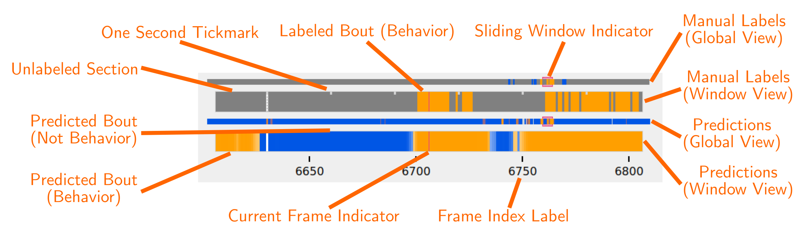

- **Manual Labels (sliding window):** Displays manually assigned labels for a
  sliding window of frames. The window range is the current frame +/-50 frames.
  Orange indicates frames labeled as showing the behavior, blue indicates frames
  labeled as not showing the behavior. Unlabeled frames are colored gray.
- **Manual Labels (global view):** Displays a zoomed out view of the manual
  labels for the entire video
- **Predicted Classes (sliding window):** Displays predicted classes (if the
  classifier has been run). Color opacity indicates prediction probability for
  the predicted class. Manually assigned labels are also displayed with
  probability of 100%.
- **Predicted Class (global view):** Displays a zoomed out view of the predicted
  classes for the entire video.
- **Sliding Window Indicator:** highlights the section of the global views that
  correspond to the frames displayed in the "sliding window" views.

By default, the Timeline shows manual labels and predicted behaviors for the
current subject animal. The Timeline can be toggled to show all subjects by
selecting View->Timeline->All Animals in the menu bar. The Timeline can also be
configured to show only manual labels or only predicted labels. If "All Animals"
is selected, the Timeline will show which set of labels and predictions belong
to the subject animal by drawing a colored border around them.

**Timeline Menu**
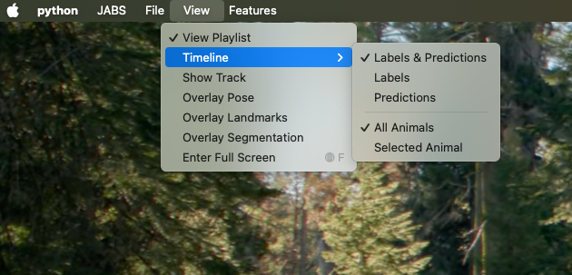

<br /><br /> **Example Timeline with "Labels & Predictions" and "All Animals"
selected**
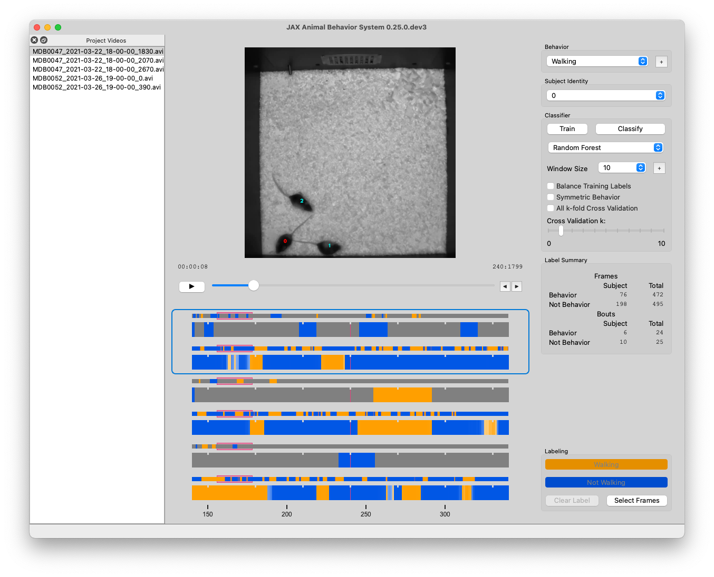

### Video Control Overlay

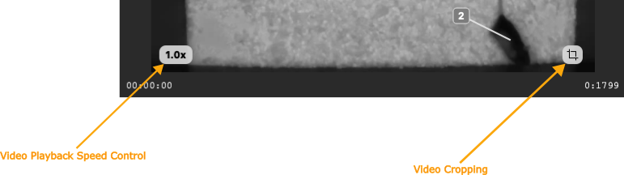

Mousing over the video player will display a control overlay with the following
controls:

- **Video Playback Speed Controls:** Controls the speed of video playback.
  Clicking this control will open a menu with options for playback speed. The
  default speed is 1x.
- **Video Cropping:** Allows the user to crop the video to a specific region of
  interest. After clicking the cropping control, the user can click and drag a
  rectangular selecting tool to select the region of interest. The video will be
  cropped to the selection, and scaled to fill the available player area. If the
  video is currently cropped, the cropping control will be replaced with a
  "Reset Cropping" control, which will reset the cropping to the original video
  size.
- **Brightness Adjustment:** Allows the user to adjust the brightness of the
  video. Clicking this control will open a slider that can be used to adjust the
  brightness.
- **Contrast Adjustment:** Allows the user to adjust the contrast of the video.
  Clicking this control will open a slider that can be used to adjust the
  contrast.

Clicking the Brightness or Contrast controls will reset the brightness or
contrast to the default value before displaying the slider control. Clicking the
video or moving the mouse off the video frame will dismiss the slider control.

### Menu

- **JABS→About:** Display About Dialog
- **JABS→User Guide:** Display User Guide
- **JABS→Quit JABS:** Quit Program
- **File→Open Project:** Select a project directory to open. If a project is
  already opened, it will be closed and the newly selected project will be
  opened.
- **File→Export Training Data:** Create a file with the information needed to
  share a classifier. This exported file is written to the project directory and
  has the form `<Behavior_Name>_training_<YYYYMMDD_hhmmss>.h5`. This file is
  used as one input for the `jabs-classify` script.
- **File→Archive Behavior:** Remove behavior and its labels from project. Labels
  are archived in the `jabs/archive` directory.
- **File→Prune Project:** Remove videos and pose files that are not labeled.
- **View:** Menu to control various display options.
  - **View→View Playlist:** can be used to hide/show video playlist
  - **View→Timeline:** Menu to control the timeline display.
  - **View→Label Overlay:** Control the floating display of manual labels or
    predicted classes.
  - **View→Identity Overlay:** Configure the identity overlay mode.
  - **View→Show Track:** show/hide track overlay for the subject. The track
    overlay shows the nose position for the previous 5 frames and the next 10
    frames. The nose position for the next 10 frames is colored red, and the
    previous 5 frames it is a shade of pink.
  - **View→Overlay Pose:** toggle the overlay of the pose on top of the subject
    mouse
  - **View→Overlay Landmarks:** toggle the overlay of arena landmarks over the
    video.
- **Features:** Menu item for controlling per-behavior classifier settings. Menu
  items are disabled when at least 1 pose file in the project does not contain
  the data to calculate features.
  - **Features→CM Units:** toggle using CM or pixel units (Warning! Changing
    this will require features to be re-calculated)
  - **Features→Enable Window Features:** toggle using statistical window
    features
  - **Features→Enable Signal Features:** toggle using fft-based window features
  - **Features→Enable Social Features:** toggle using social features (v3+
    projects)
  - **Features→Enable Corners Features:** toggle using arena corner features
    (v5+ projects with arena corner static object)
  - **Features→Enable Lixit Features:** toggle using lixit features (v5+
    projects with lixit static object)
  - **Features→Enable Food_hopper Features:** toggle using food hopper features
    (v5+ projects with food hopper static object)
  - **Features→Enable Segmentation Features:** toggle using segmentation
    features (v6+ projects)

#### Overlay Examples

**Track Overlay Example:**\


**Pose Overlay Example:**\
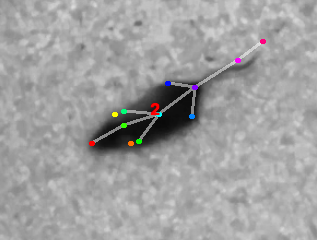

**Pose Overlay Keypoint Legend:**\
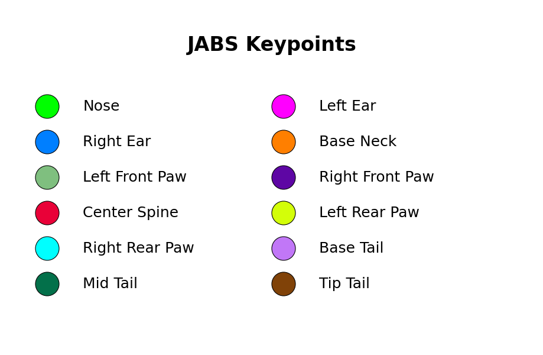

##### Identity Overlay

JABS offers several ways to overlay mouse identities on the video. Choose a mode
from View → Identity Overlay.

In all modes, you can select the subject directly in the video: click inside the
convex hull of body keypoints (excluding the tail) to select that animal. You
can also click the floating identity label. With the Bounding Box overlay,
clicking the tab selects the animal. These options are in addition to the
Identity dropdown in the main window and the Shift+↑ / Shift+↓ keyboard
shortcuts.

**Floating:**

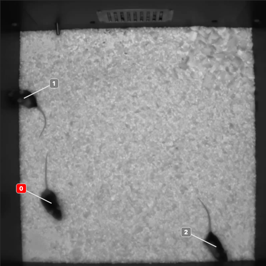

**Centroid:**

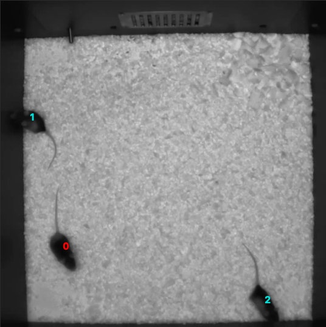

**Minimalist:**

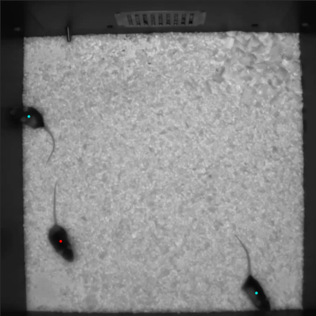

**Bounding Box:**

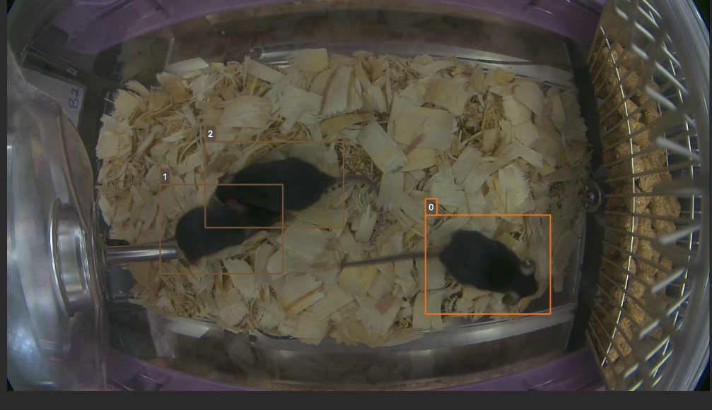

## Labeling

This section describes how a user can add or remove labels. Labels are always
applied to the subject mouse and the current subject can be changed at any time.
A common way to approach labeling is to scan through the video for the behavior
of interest, and then when the behavior is observed select the mouse that is
showing the behavior. Scan to the start of the behavior, and begin selecting
frames. Scan to the end of the behavior to select all of the frames that belong
to the bout, and click the label button.

### Selecting Frames

When "Select Mode" is activated, JABS begins a new selection starting at that
frame. The current selection is from the selection start frame through the
current frame. Applying a label, or removing labels from the selection clears
the current selection and leaves "Select Mode".

The current selection range is shown on the "Manual Labels" display:\
\
Clicking the "Select Frames" button again or pressing the Escape key will
deselect the frames and leave select mode without making a change to the labels.

### Applying Labels

The label **Behavior** button will mark the selected interval of frames as
showing the current behavior. The label **Not Behavior** button will mark all
the frames in the selected interval as not showing the behavior. The **New
Timeline Annotation** button will open the Timeline Annotation Editor dialog to
create a new timeline annotation for the selected interval. Finally, the "Clear
Labels" button will remove all labels from the currently selected frames.

### Timeline Annotations

Timeline annotations mark frame intervals that are not tied to a behavior label.
They are never used for training and can apply to the entire video or to a
specific animal (via an identity). Each annotation includes a short tag, an
optional description, and a display color. Tags appear as overlays in the video
and can be searched (with search hits highlighted in the label timeline), making
it easy to flag edge cases, highlight areas of disagreement for review, or note
uncertainty and poor pose quality.

#### Where They’re Stored

Each video’s annotations are saved to `jabs/annotations/<video_name>.json`
inside the project directory.

Example annotation file (other top-level fields omitted for clarity):

```json
{
  "annotations": [
    {
      "start": 100,
      "end": 200,
      "tag": "identity",
      "identity": 0,
      "color": "#ff0000",
      "description": "identity is wrong"
    },
    {
      "start": 150,
      "end": 250,
      "tag": "obstructed",
      "identity": null,
      "color": "#0000ff",
      "description": "view is obstructed"
    }
  ]
}
```

##### Fields

- start (int): first frame index (inclusive).
- end (int): last frame index (inclusive).
- tag (str): short label for quick identification (see Tag rules).
- identity (int | null): optional animal identity; if omitted or null, the
  annotation applies to the whole video.
- color (str): display color, e.g. `#RRGGBB` or an SVG color name.
- description (str, optional): free-text notes.

##### Tag Rules

- Characters: letters, digits, underscores `_`, and hyphens `-`; **no
  whitespace**.
- Length: 1–32 characters.
- Matching/filtering is case-insensitive; display preserves your original
  casing.

##### How They’re Displayed

- Tag Overlay: the tag appears as a badge in the video.
- If identity is set, the tag follows that animal.
- If the pose file includes external identity mapping, the JABS identity is
  converted to the external ID for display.
- If pose is missing, the tag snaps to the upper-left corner and is prefixed
  with the identity (e.g., 1234: tag).
- Clicking a tag opens details.

### Labeling Using Keyboard Shortcuts

Using the keyboard controls can be the fastest way to label.

#### Navigation Keyboard Controls

The arrow keys can be used for stepping through video. The up arrow skips ahead
10 frames, and the down arrow skips back 10 frames. The right arrow advances one
frame, and the left arrow goes back one frame.

#### Labeling Controls

The z, x, and c keys can be used to apply labels.

**If in select mode:**

- **z:** label current selection as "behavior"
- **x:** clear labels from current selection
- **c:** label current selection as "not behavior"

**If not in select mode:**

- **z, x, c:** start selecting frames.

## Identity Gaps

Identities can have gaps if the mouse becomes obstructed or the pose estimation
failed for those frames. In the manual label visualization, these gaps are
indicated with a pattern fill instead of the solid gray/orange/blue colors. In
the predicted class visualization, the gaps are colored white (meaning no
prediction exists for these frames).


Labels can be saved on frames where the identity is missing; however, these
labels are excluded from classifier training. In the label timeline, labels
applied to identity gaps are displayed with partial transparency, allowing the
gap pattern fill to remain visible.

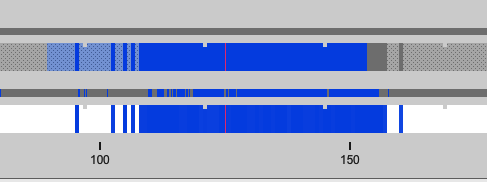

> **Note:** Gaps are excluded from classifier training but are still displayed
> in timelines. Labels applied in gap regions use partial transparency and won’t
> bias the classifier.

## All Keyboard Shortcuts

| Action                                   | Shortcut          |
| ---------------------------------------- | ----------------- |
| Quit JABS                                | Ctrl+Q / Cmd+Q    |
| Export training data                     | Ctrl+T / Cmd+T    |
| Play / Pause video                       | Space bar         |
| Previous / Next frame                    | ← / →             |
| Move forward / back 10 frames            | ↑ / ↓             |
| Previous / Next video                    | , / .             |
| Start select mode                        | z, x, c           |
| Label selection as behavior              | z                 |
| Clear labels from selection              | x                 |
| Label selection as not behavior          | c                 |
| Exit select mode without making a change | Esc               |
| Select all frames                        | Ctrl+A / Cmd+A    |
| Switch to next / previous subject        | Shift+↑ / Shift+↓ |
| Toggle track overlay                     | t                 |
| Toggle pose overlay                      | p                 |
| Toggle landmark overlay                  | l                 |
| Toggle Minimalist Identity Labels        | Ctrl+I / Cmd+I    |
| Open behavior search dialog              | Ctrl+F / Cmd+F    |

> **Note:** Next/previous subject order follows the “Identity Selection”
> dropdown ordering.

## The Command Line Classifier

JABS includes a script called `jabs-classify`, which can be used to classify a
single video from the command line.

```text
usage: jabs-classify COMMAND COMMAND_ARGS

commands:
 classify   classify a pose file
 train      train a classifier that can be used to classify multiple pose files

See `jabs-classify COMMAND --help` for information on a specific command.
```

```text
usage: jabs-classify classify [-h] [--random-forest | --gradient-boosting | --xgboost]
                            (--training TRAINING | --classifier CLASSIFIER) --input-pose
                            INPUT_POSE --out-dir OUT_DIR [--fps FPS]
                            [--feature-dir FEATURE_DIR]

optional arguments:
  -h, --help            show this help message and exit
  --fps FPS             frames per second, default=30
  --feature-dir FEATURE_DIR
                        Feature cache dir. If present, look here for features before computing.
                        If features need to be computed, they will be saved here.

required arguments:
  --input-pose INPUT_POSE
                        input HDF5 pose file (v2, v3, or v4).
  --out-dir OUT_DIR     directory to store classification output

optionally override the classifier specified in the training file:
 Ignored if trained classifier passed with --classifier option.
 (the following options are mutually exclusive):
  --random-forest       Use Random Forest
  --gradient-boosting   Use Gradient Boosting
  --xgboost             Use XGBoost

Classifier Input (one of the following is required):
  --training TRAINING   Training data h5 file exported from JABS
  --classifier CLASSIFIER
                        Classifier file produced from the `jabs-classify train` command
```

```text
usage: jabs-classify train [-h] [--random-forest | --gradient-boosting | --xgboost]
                         training_file out_file

positional arguments:
  training_file        Training h5 file exported by JABS
  out_file             output filename

optional arguments:
  -h, --help           show this help message and exit

optionally override the classifier specified in the training file:
 (the following options are mutually exclusive):
  --random-forest      Use Random Forest
  --gradient-boosting  Use Gradient Boosting
  --xgboost            Use XGBoost
```

> Note: XGBoost may be unavailable on macOS if `libomp` isn’t installed. See
> `jabs-classify classify --help` output for list of classifiers supported in
> the current execution environment.

> Note: fps parameter is used to specify the frames per second (used for scaling
> time unit for speed and velocity features from "per frame" to "per second").

## Command Line Feature Generation

JABS includes a script called `jabs-features`, which can be used to generate a
feature file for a single video from the command line.

```text
usage: jabs-features [-h] --pose-file POSE_FILE --pose-version POSE_VERSION
                            --feature-dir FEATURE_DIR [--use-cm-distances]
                            [--window-size WINDOW_SIZE] [--fps FPS]

options:
  -h, --help            show this help message and exit
  --pose-file POSE_FILE
                        pose file to compute features for
  --pose-version POSE_VERSION
                        pose version to calculate features
  --feature-dir FEATURE_DIR
                        directory to write output features
  --use-cm-distances    use cm distance units instead of pixel
  --window-size WINDOW_SIZE
                        window size for features (default none)
  --fps FPS             frames per second to use for feature calculation
```

## File Formats

This section documents the format of JABS output files that may be needed for
downstream analysis.

### Prediction File

An inference file represents the predicted classes for each identity present in
one video file.

#### Location

The prediction files are saved in
`<JABS project dir>/jabs/predictions/<video_name>.h5` if they were generated by
the JABS GUI.

The `jabs-classify` script saves inference files in
`<out-dir>/<video_name>_behavior.h5`

#### Contents

The H5 file contains one group, called `predictions`. This group contains one or
more behavior prediction groups. Each behavior prediction group contains 3
datasets and 1 new group.

```text
predictions/
  behavior_1/
    predicted_class
    probabilities
    identity_to_track
  behavior_2/
    ...
```

##### Attributes

The root file contains the following attributes:

- pose_file: filename of the pose file used during prediction
- pose_hash: blake2b hash of pose file
- version: prediction output version

Each behavior prediction group contains the following attributes:

- classifier_file: filename of the classifier file used to predict
- classifier_hash: blake2b hash of the classifier file
- app_version: JABS application version used to make predictions
- prediction_date: date when predictions were made

##### predicted_class

- dtype: 8-bit integer
- shape: #identities x #frames

This dataset contains the predicted class. Each element contains one of three
values:

- 0: "not behavior"
- 1: "behavior"
- -1: "identity not present in frame".

##### probabilities

- dtype: 32-bit floating point
- shape: #identities x #frames

This dataset contains the probability (0.0-1.0) of each prediction. If there is
no prediction (the identity doesn't exist at a given frame) then the prediction
probability is 0.0.

##### identity_to_track

- dtype: 32-bit integer
- shape: #identities x #frames

This dataset maps each JABS-assigned identity (Pose version 3) back to the
original track ID from the pose file at each frame. -1 indicates the identity
does not map to a track for that frame. For Pose File Version 4 and greater,
JABS uses the identity assignment contained in the pose file. For pose version
2, there will be exactly one identity (0).

### Feature File

A feature file represents features calculated by JABS for a single animal in a
video file.

#### Location

Feature files are saved per identity at
`<JABS project dir>/jabs/features/<video_name>/<identity>/features.h5`.

#### Contents

The H5 file contains feature data described in the
[feature documentation](../features/features.md). Features used in JABS
classifiers are located within the `features` group, further separated by
`per_frame` and `window_features_<window_size>` groups. Features not used in
JABS classifiers are located outside the `features` group.

All features are a vector of data containing the feature value for each frame in
the video.

The root file contains the following attributes:

- distance_scale_factor: scale factor used when converting from pixel space to
  cm space
- identity: identity value from the original pose value
- num_frames: number of frames in the video
- pose_hash: blake2b hash of pose file
- version: feature version used when generating this feature file

##### Per-Frame Feature Names

Per frame features are named `<feature module> <feature name>`. Feature modules
cannot contain spaces, while feature names can.

##### Window Feature Names

Window features are named `<feature module> <window operation> <feature name>`.
Feature modules and window operations cannot contain spaces, while feature names
can.

## jabs-cli

`jabs-cli` is a command line interface that provides access to JABS utilities
that did not warrant a full command line tool. To get a listing of current
commands, run:

```bash
jabs-cli --help
```
